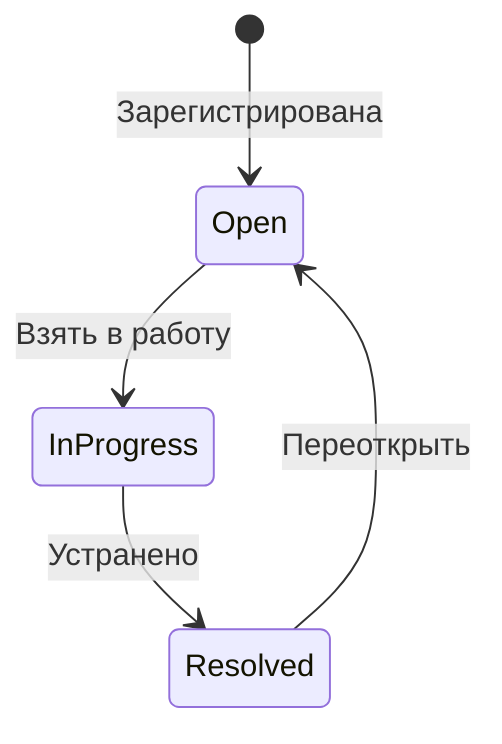

<div align="center">

# 🔍 Leak Tracker

**Полевая система учёта и контроля утечек газа**

[](https://react.dev)
[](https://vitejs.dev)
[](https://capacitorjs.com)
[](https://leafletjs.com)
[](#-офлайн-карты)

_Мобильное приложение для регистрации, мониторинга и отчётности по утечкам в нефтегазовой отрасли._  
_Работает полностью офлайн, поддерживает мультипроектность и перенос данных между устройствами._

</div>

---

## ✨ Возможности

|     | Функция                       | Описание                                                                |
| --- | ----------------------------- | ----------------------------------------------------------------------- |
| 📋  | **Регистрация утечек**        | Многошаговая форма с фото, координатами и расчетами                     |
| 🗺️  | **Офлайн-карта**              | Leaflet с локальным кэшем тайлов и кластеризацией                       |
| 🎤  | **Голосовой ввод**            | Распознавание речи с fuzzy matching и preview-подтверждением            |
| 📦  | **Импорт / Экспорт проектов** | ZIP-бэкап с метаданными проекта и фотографиями                          |
| 📊  | **Экспорт отчетов**           | XLSX / KML / JSON                                                       |
| 🔄  | **Lifecycle Management**      | Open → In Progress → Resolved + история изменений                       |
| 🗂️  | **База данных**               | Фильтры по статусу, приоритету, GPS-близости; bulk-действия; сортировка |
| 🌙  | **Темизация**                 | Поддержка dark / light mode                                             |
| 📱  | **Android Ready**             | Capacitor 8 native build                                                |

---

## 🚀 Быстрый старт

```bash
git clone <repo>
cd leak-tracking
npm install
npm run dev
```

---

## 🏗️ Технологический стек

```text
Frontend        React 19 + Vite 6
Styling         SCSS Modules / CSS Variables
Mobile          Capacitor 8
Maps            Leaflet + MarkerCluster
Storage         localStorage / IndexedDB / Filesystem
Export          ExcelJS / JSZip / XLSX
Validation      Zod
Testing         Vitest + Testing Library
```

### 📦 Зависимости

| Категория | Пакеты |
|-----------|--------|
| **Core** | React 19.2, React DOM 19.2, Vite 6 |
| **Mobile** | Capacitor 8 (android, camera, cli, core, filesystem, geolocation, share), speech-recognition |
| **Maps** | Leaflet 1.9, Leaflet MarkerCluster 1.5 |
| **Export** | ExcelJS 4.4, JSZip 3.10, XLSX 0.18 |
| **Validation** | Zod 4.3 |
| **UI** | clsx 2.1 |
| **Testing** | Vitest, Testing Library (DOM, Jest, React, User Event) |

---

## 📁 Архитектура проекта

```text
src/
├── app/                # App state / migrations / project settings
├── pages/              # Основные экраны приложения
├── components/         # UI-компоненты и sheets/modals
├── configs/            # Конфиги upstream/midstream/downstream
├── hooks/              # Бизнес- и UI-хуки
├── services/           # Export / Maps / Storage logic
├── utils/              # Calculations / Voice / Normalize helpers
└── tests/              # Unit tests
```

---

## 🗂️ Поддерживаемые типы проектов

| Тип        | Назначение                 |
| ---------- | -------------------------- |
| Upstream   | Добыча                     |
| Midstream  | Транспортировка и хранение |
| Downstream | Переработка / Сбыт         |

Каждый тип проекта использует собственную схему полей, форму ввода и экспортный шаблон.

---

## 📊 Модель объекта утечки

```ts
interface LeakRecord {
  id: number;
  projectId: string;
  createdAt: string;
  updatedAt: string;

  status: "open" | "in_progress" | "resolved";
  priority: "low" | "medium" | "high" | "critical";

  location: {
    lat: number;
    lng: number;
    accuracy?: number;
  };

  component: string;
  componentTag?: string;
  leakType: string;
  leakRate?: number;
  pressure?: number;

  description?: string;
  photosBefore: string[];
  photosAfter?: string[];

  assignedTo?: string;
  resolvedAt?: string;

  history: LeakHistoryEntry[];
}
```

---

## 📦 Импорт / Экспорт

Проект поддерживает перенос данных между устройствами через ZIP-архив:

```text
Export ZIP
├── project.json        # Метаданные проекта (schemaVersion, name, type, vars)
├── backup.json         # Все записи утечек
└── photos/             # Связанные изображения (before / after)
```

При импорте автоматически:

- тип проекта определяется из `project.json` или автоматически по полям записей;
- создаётся новый проект и активируется;
- восстанавливаются записи, фотографии и переменные расчётов;
- инициализируется локальное хранилище.

---

## 🗺️ Офлайн-карты

```text
Tile Request
   ↓
Network Available?
 ├─ Yes → Cache Tile
 └─ No  → Load From Cache
```

Поддерживается кэширование карт для работы в полностью изолированных сетях.

---

## 🗂️ База данных (DataBase)

Страница со списком всех утечек проекта:

- **Поиск** по ID, объекту, описанию
- **Фильтры**: статус (Open / In Progress / Resolved), приоритет (Low / Medium / High / Critical), GPS-фильтр «Рядом со мной»
- **Сортировка** по дате (новые / старые)
- **Bulk-действия**: выбор нескольких записей, массовое изменение статуса, последовательное закрытие с фото
- **Экспорт** отфильтрованного набора в XLSX / KML / ZIP

---

## 🔒 Приватность

- Все данные хранятся локально на устройстве
- Нет серверной части / облака / телеметрии
- Подходит для air-gapped environments

---

## 📱 Сборка и запуск на телефоне

### Android

```bash
npm run build
npm run cap:sync android
npx cap open android
```

Далее в Android Studio:

1. Подключить устройство / эмулятор
2. Нажать **Run**
3. APK установится на телефон

### iOS

```bash
npm run build
npx cap sync ios
npx cap open ios
```

Далее открыть проект в Xcode и выполнить build на устройство.

---

## ⚙️ Production Deployment Notes

- Для Android рекомендуется включить ProGuard / R8
- Для iOS — настроить permissions в Info.plist
- Перед релизом очистить dev-логирование и mock data
- Рекомендуется включить versioned migrations для local storage

---

## 📜 Скрипты

```bash
npm run dev       # Development server
npm run build     # Production build
npm run preview   # Preview build
npm test          # Run tests
npm run cap:sync      # Sync Capacitor
```

---

## 🧭 Архитектурная диаграмма


---

## 🔄 State Machine: Leak Lifecycle



---

## 🏆 Архитектурные особенности

- **Offline-First Core** — приложение полностью функционально без сети
- **Project Isolation** — каждый проект хранится в отдельном namespace
- **Portable Backup System** — перенос проекта одним ZIP-файлом
- **Extensible Config Architecture** — новые project types добавляются конфигом
- **Native Device Integration** — Camera / Filesystem / Geolocation / Speech API

---

## 📈 Roadmap

- [ ] Cloud Sync / Optional Backend Mode
- [ ] Multi-user Collaboration
- [ ] Advanced Analytics Dashboard
- [ ] GIS Layer Import / Overlay Support
- [ ] Enterprise Audit Trail / Signatures

---

## 🤝 Для кого создан проект

- LDAR / Methane Management Teams
- Field Inspectors
- Compressor Station Operators
- Environmental Compliance Engineers
- Oil & Gas Asset Integrity Teams

---

<div align=\"center\">

**Industrial-grade leak management platform for field operations.**

</div>
