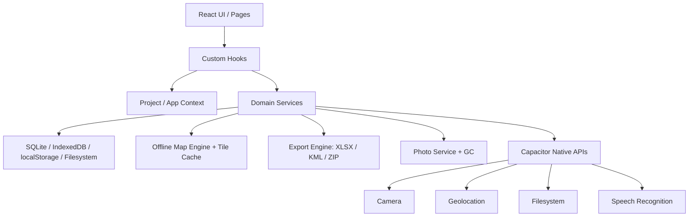
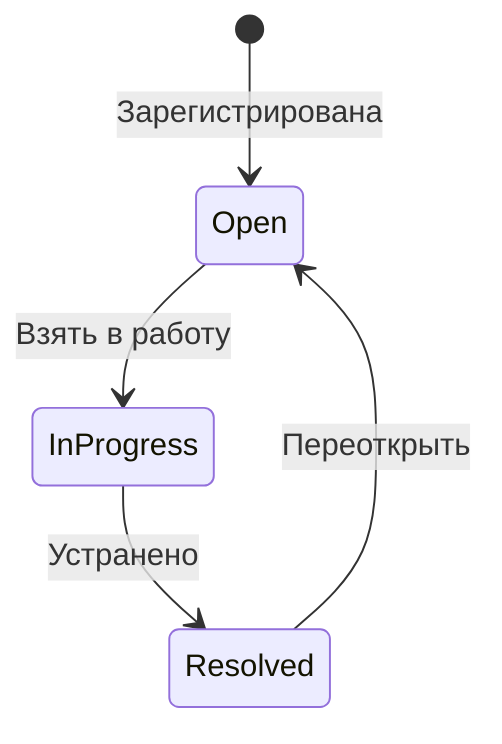

<div align="center">

# 🔍 Leak Tracker

**Полевая система учёта и контроля утечек газа**

[](https://react.dev)
[](https://vitejs.dev)
[](https://capacitorjs.com)
[](https://leafletjs.com)
[](#-офлайн-карты)

_Мобильное приложение для регистрации, мониторинга и отчётности по утечкам в нефтегазовой отрасли._  
_Работает полностью офлайн, поддерживает мультипроектность и перенос данных между устройствами._

📖 **[Руководство пользователя со скриншотами](docs/MANUAL.md)** · 📱 **[Версия для Android (PDF)](docs/Leak-Tracker-Android-Manual.pdf)**

</div>

---

## ✨ Возможности

|     | Функция                        | Описание                                                                        |
| --- | ------------------------------ | ------------------------------------------------------------------------------- |
| 📋  | **Регистрация утечек**         | Многошаговая форма с фото, координатами и расчетами                             |
| 🧰  | **Реестр компонентов**         | Инвентаризация железа: карточка с фото, номер обходчика, осмотры, схемы         |
| 🔎  | **Повторный мониторинг**       | Обходы, повторные проверки и отдельное фото каждой записи                       |
| 🗺️  | **Офлайн-карта**               | Leaflet с локальным кэшем тайлов и кластеризацией                               |
| 🎤  | **Голосовой ввод**             | Распознавание речи с fuzzy matching и preview-подтверждением                    |
| 📦  | **Импорт / Экспорт проектов**  | ZIP-бэкап с метаданными проекта и фотографиями                                  |
| 🔁  | **Локальная QR-синхронизация** | Обмен ZIP-архивами между Android-устройствами в доверенной локальной сети       |
| 📊  | **Excel / KML / ZIP отчёты**   | XLSX/Excel ZIP с фото, мониторингом и историей / KML / JSON / ZIP               |
| 🧩  | **Импорт одной кнопкой**       | Тип файла (ZIP-бэкап / XLSX / архив инвентаризации) определяется по нему самому |
| 🔄  | **Lifecycle Management**       | Open → In Progress → Resolved + история изменений                               |
| 🗂️  | **База данных**                | Фильтры по статусу, приоритету, GPS-близости; bulk-действия; сортировка         |
| 📁  | **Выбор объекта**              | Навигация по локациям как по папкам; область действует на все экраны            |
| ✅  | **Проверка данных**            | Поиск пропущенных фото, битых ссылок, координат и дублей `leak_id`              |
| ⚙️  | **Настройки проекта**          | Обязательность фото, видимость полей, параметры расчёта, режим Excel            |
| 🌐  | **RU / EN интерфейс**          | Переключение языка основных пользовательских сценариев                          |
| 🌙  | **Темизация**                  | Dark / light mode; по умолчанию следует настройке телефона                      |
| 📱  | **Android Ready**              | Capacitor 8 native build                                                        |

---

## 🚀 Быстрый старт

Требуется Node.js 22 или новее (`engines.node` в `package.json`; это же минимальная
версия для Capacitor CLI 8).

```bash
git clone <repo>
cd leak-tracking
cp .env.example .env        # значения по умолчанию рабочие, править не обязательно
npm install                 # ставит husky-хуки и патчит Gradle (postinstall)
npm run dev
```

`npm install` выполняет `postinstall` → `scripts/patch-gradle.js` и `prepare` → `husky`.
Если ставите с `--ignore-scripts`, оба шага нужно выполнить вручную.

### Переменные окружения

Все переменные необязательны — без `.env` приложение собирается на значениях
по умолчанию. Шаблон лежит в `.env.example`.

| Переменная                               | По умолчанию       | Назначение                                             |
| ---------------------------------------- | ------------------ | ------------------------------------------------------ |
| `VITE_TILE_URL`                          | ESRI World Imagery | Базовый URL тайлового сервера                          |
| `VITE_TILE_ATTRIBUTION`                  | —                  | Обязательна для не-ESRI провайдера тайлов              |
| `VITE_BASE_PATH`                         | `/`                | Подпапка публикации, например `/leak-tracking/`        |
| `VITE_OFFLINE_MAP_ONLY`                  | `false`            | Полный запрет сетевых тайлов; origin не попадает в CSP |
| `VITE_REQUIRE_PRIVATE_TILE_PROVIDER`     | `false`            | Отклонить сборку на публичном тайловом сервере         |
| `VITE_RENDER_METRICS`                    | выкл.              | Метрики рендеринга для perf-тестов                     |
| `VITE_ENABLE_NATIVE_STORAGE_PERFORMANCE` | выкл.              | Замеры нативного хранилища                             |

---

## 🏗️ Технологический стек

```text
Frontend        React 19 + Vite 8
Styling         SCSS Modules / CSS Variables
Mobile          Capacitor 8
Maps            Leaflet + MarkerCluster
Storage         SQLite (Android) / IndexedDB (web) / localStorage / Filesystem
Export          ExcelJS / JSZip / KML
i18n            i18next + react-i18next
Testing         Vitest + Testing Library + Playwright
```

### 📦 Зависимости

| Категория       | Пакеты                                                                                                                                    |
| --------------- | ----------------------------------------------------------------------------------------------------------------------------------------- |
| **Core**        | React 19.2, React DOM 19.2, Vite 8                                                                                                        |
| **Mobile**      | Capacitor 8 (android, camera, core, filesystem, geolocation, share; CLI — в devDependencies), speech-recognition, ML Kit barcode scanning |
| **Maps**        | Leaflet 1.9, Leaflet MarkerCluster 1.5                                                                                                    |
| **Export / QR** | ExcelJS 4.4, JSZip 3.10, QRCode 1.5                                                                                                       |
| **i18n**        | i18next, react-i18next                                                                                                                    |
| **UI**          | clsx 2.1                                                                                                                                  |
| **Testing**     | Vitest 4, Testing Library (DOM, Jest DOM, React, User Event), Playwright, fake-indexeddb, jsdom                                           |
| **Tooling**     | TypeScript 7 в гейте типов, 6 для линта (см. CONTRIBUTING), ESLint 10, Prettier 3, Sass, husky + lint-staged                              |

---

## 📁 Архитектура проекта

```text
src/
├── app/
│   ├── App.jsx
│   ├── AppRoutes.jsx       # Экранный роутинг + предупреждение о хранилище
│   ├── hooks/              # useAppState, useProjectData, useTheme, useVoiceControl
│   ├── migrations/         # One-time legacy data cleanup
│   └── project/            # ProjectContext + project storage/migration/keys
│       └── hooks/          # useProjectConfig, useProjectVars, useHiddenFields, …
│
├── components/
│   ├── layout/             # Header, Footer, PageHeader (structural shells)
│   └── ui/                 # ConfirmSheet, MobileSheet, Notification, StatusBadge, ErrorBoundary
│
├── configs/
│   ├── index.js            # Barrel → PROJECT_CONFIGS, PROJECT_META
│   ├── projects.js
│   ├── projectAdapter.js
│   ├── projectLocation.config.js
│   ├── shared/             # Common fields + steps across project types
│   ├── upstream/           # UPSTREAM_CONFIG + data/fields + data/steps
│   ├── midstream/
│   └── downstream/
│
├── data/
│   ├── leak/               # fieldDictionary, statusDictionary, priorityDictionary
│   └── variables.js        # Типы газов, оборудование, дефолты расчётных переменных
│
├── domain/                 # Правила предметной области вне UI
│   ├── leakLifecycle.js    # Разрешённые переходы статусов
│   └── componentTombstones.js # Удалённые карточки реестра
│
├── features/               # Domain components — one folder per bounded context
│   ├── editTextField/
│   ├── calculationParameters/ # Shared calculation parameter form
│   ├── componentRegistry/  # Карточка компонента, листы осмотра и подробностей
│   │                       # + ComponentRegistryContext — один список реестра
│   │                       #   на всё приложение (экран, карта, шапка, форма)
│   ├── fieldVisibility/    # FieldVisibilityModal
│   ├── importConflict/     # Merge / overwrite / copy preview sheet
│   ├── leakDetails/        # LeakDetailsSheet + hooks + sub-components
│   ├── leakForm/           # LeakForm + LeakFormContext + hooks + Header/Footer
│   │   └── components/     # ClearActions, InputCard, StepRenderer
│   ├── leakList/           # VirtualizedLeakList, LeakCardCompact
│   ├── locationScope/      # LocationBrowser — выбор объекта как навигация по папкам
│   ├── photos/             # PhotoViewer, PhotoInput
│   ├── resolve/            # ResolveModal
│   ├── schemas/            # Технологические схемы: список, просмотрщик, PDF наружу
│   ├── search/             # Autocomplete (+ smartFilter)
│   ├── settings/           # SettingsModal (UI only; page logic lives in pages/Settings)
│   ├── status/             # StatusPickerModal
│   └── voice/              # VoiceButton, VoicePreviewSheet
│       └── utils/          # numbers, normalization, matching, synonyms, parseVoiceText, …
│
├── hooks/                  # Shared hooks used in 2+ features
│   ├── cameraService.js    # Co-located with sole consumer useCamera
│   ├── photoService.js
│   ├── speechService.js
│   ├── useCamera.js
│   ├── useEditablePhoto.js
│   ├── useFormDraft.js
│   ├── useGeolocation.js
│   ├── usePhotoStorage.js
│   └── …
│
├── pages/
│   ├── AddLeak/
│   ├── ComponentRegistry/  # Экран реестра, форма карточки, полосы фильтров
│   ├── DataBase/           # + excel.js + hooks/ + components/
│   ├── MainPage/
│   ├── MapPage/            # + offlineMap.js + kml.js + handleExport.js + hooks/
│   ├── Monitoring/
│   ├── ProjectSetup/
│   └── Settings/           # + backup.js + hooks/ + components/
│
├── locales/                # ru/ и en/ по неймспейсам + loadLanguage (ленивая загрузка)
│
├── repositories/           # Доступ к данным; выбор бэкенда скрыт за фасадом
│   ├── idb.js              # createIdbStore() factory (IndexedDB)
│   ├── idbConnection.js    # Открытие соединения: blocked/versionchange
│   ├── webEnvelopeRecords.js      # Одна запись конверта в IndexedDB
│   ├── webProjectEnvelopeStore.js # Наборы данных проекта и их ключи
│   ├── LeakRepository.js
│   ├── PhotoRepository.js
│   ├── ComponentRepository.js     # Реестр компонентов
│   ├── SchemaRepository.js        # Технологические схемы
│   ├── nativeLeakStorage.js       # SQLite-хранилище на Android
│   ├── nativeComponentStorage.js  # Реестр в том же SQLite, своим ключом проекта
│   ├── nativeSqliteMutation.js    # Транзакционные мутации нативной базы
│   ├── webProjectEnvelope.js      # Формат конверта и его ревизии
│   ├── backupSchema.js     # Manual validation for ZIP import/export
│   └── compressImage.js
│
├── services/               # One directory per subsystem; no loose files
│   ├── archive/            # zipStoreStream, archivePaths — shared by import/export
│   ├── backup/             # projectBackupService facade + merge/import/export parts
│   ├── excelExport/        # Workbook building, run in a Web Worker
│   ├── import/             # excelImportService facade + XLSX/ZIP parsing + importRouting
│   ├── inventory/          # Архив инвентаризации: сборка, служебный лист, ввод обратно
│   ├── maps/               # tileCache — offline tile storage
│   ├── storage/            # persistentStorage, publicFileWriter, leakFieldVersions
│   └── sync/               # localSyncService, projectSyncState, syncClock
│
├── utils/
│   ├── calculations/       # Emissions & flow-rate calculations
│   ├── normalize/          # capitalizeFirst, normalizeNumber, parseNumericInput
│   ├── geoUtils.js
│   ├── haptics.js
│   ├── photoConversion.js
│   ├── platform.js
│   ├── priority.js
│   ├── status.js
│   └── timeAgo.js
│
├── types/                  # TS-контракты домена и деклараций (проверяются typecheck)
├── test/                   # setup.js для Vitest + тестовый переводчик
│
├── i18n.js                 # Инициализация i18next
├── index.jsx               # App entry point
├── index.scss              # Global CSS variables + base styles
└── reportWebVitals.js
```

Вне `src/`:

```text
android/        Нативный проект Capacitor
e2e/            Playwright-сценарии (smoke, офлайн, кросс-браузерные)
performance/    Нагрузочные сценарии на 1 000 / 10 000 записей
scripts/        Release-гейты: бюджеты, лицензии, SBOM, подпись, чек-суммы
design/         Референсные макеты карточек и экранов
public/         Статика, manifest, service worker
```

> **Placement rule (hook / service / util):** co-locate with the single consumer;
> promote to `src/hooks/` / `src/services/` / `src/utils/` only when used by 2+
> unrelated features. Consumer count = 0 → delete. See `CONTRIBUTING.md`.

---

## 💾 Хранилище данных

Доступ к данным идёт только через `src/repositories/`; вызывающий код не знает,
какой бэкенд под ним.

| Платформа | Записи утечек                                         | Реестр компонентов                                | Фотографии         |
| --------- | ----------------------------------------------------- | ------------------------------------------------- | ------------------ |
| Android   | SQLite через собственный плагин `NativeLeakStorage`   | Тот же SQLite, ключ проекта `components:<папка>`  | Файлы в Filesystem |
| Web       | `LeakTrackingDataDB` + зеркало `LeakTrackingMirrorDB` | Те же базы, ключ записи `components:<id проекта>` | IndexedDB (blob)   |
| Оба       | Настройки, фильтры и активный проект — `localStorage` | Схемы — `LeakTrackingSchemasDB` / файлы           |                    |

Плагин `NativeLeakStorage` реализован в
`android/app/src/main/java/com/leak/tracking/` (`NativeLeakStoragePlugin.java`,
`LeakDatabaseStore.java`). Если плагин недоступен — например, приложение открыто
как веб-страница или собрано без нативной части — `nativeLeakStorage.js`
автоматически переключается на прежнее хранение проекта в JSON-файле
(`legacyNativeLeakStorage.js`), поэтому данные не теряются при откате.

У проекта не один набор записей, а два: утечки и реестр компонентов. Лежат
они в одних и тех же сторах, различаясь ключом записи, — на обеих платформах
одинаково. Отсюда три следствия. Наборы удаляются **одной транзакцией**:
реестр, переживший свой проект, доставался тому, кого заводили следующим под
тем же именем. Реестр получил ревизию, контрольную сумму, **зеркальную копию**
и журнал дельт — всё, что было построено для утечек; своей базой он лежал одной
записью без единой из этих защит. И одна исправленная карточка теперь стоит
одной записи в журнале вместо структурной копии всего обхода — раньше так умело
только устройство.

Ключ утечек при этом не изменился: они лежат под голым идентификатором проекта,
как их клали все прежние сборки. Реестр переезжает из своей прежней базы
`LeakTrackingComponentsDB` при первом чтении, и оттуда не стирается — переезд,
теряющий обход, хуже лишней копии.

Список реестра в приложении один: `ComponentRegistryProvider` читает его один
раз на проект, а экран реестра, карта, выбор места в шапке и привязка карточки
к утечке берут прочитанное у него. Читается он по требованию — проект без
реестра и сессия, которая его не открывает, не платят ничего. Запись, идущая
мимо провайдера (архив инвентаризации, импорт проекта), сообщает о себе
сигналом `componentRegistrySignal`, иначе экран показывал бы список,
прочитанный до импорта.

Реестр компонентов живёт в том же SQLite, но под собственным ключом проекта:
таблица плагина держит записи по ключу и `id` и внутрь полезной нагрузки не
смотрит, поэтому две базы делят один транзакционный файл и не могут
столкнуться. На вебе реестр вынесен в отдельную IndexedDB — контейнер утечек
читается целиком при каждом старте, и тысячи карточек в нём затормозили бы
запуск. Как и у утечек, есть откат: без плагина реестр пишется в
`LeakReports/<папка>/data/components.json`, и обход, записанный до перехода на
SQLite, переезжает оттуда один раз.

---

## 🗂️ Поддерживаемые типы проектов

| Тип        | Назначение                 |
| ---------- | -------------------------- |
| Upstream   | Добыча                     |
| Midstream  | Транспортировка и хранение |
| Downstream | Переработка / Сбыт         |

Каждый тип проекта использует собственную схему полей, форму ввода и экспортный шаблон.

**Реестр компонентов объявлен только у Upstream** — соседним блоком
`config.components`, который грузится лениво. Нет блока — нет реестра: вкладка
в нижней навигации не появляется, и никаких сравнений по типу проекта в коде
для этого не нужно.

### Выбор объекта (иерархия локаций)

У каждого типа проекта три уровня локации, и они образуют дерево:

| Тип        | Уровень 1     | Уровень 2        | Уровень 3 |
| ---------- | ------------- | ---------------- | --------- |
| Upstream   | Подразделение | Месторождение    | Локация   |
| Midstream  | УМГ           | Станция          | Локация   |
| Downstream | Район         | Населённый пункт | Адрес     |

Кнопка с текущим путём в шапке открывает выбор объекта — список папок с числом
утечек в каждой. Выбор папки открывает Базу с её содержимым, как открытие папки
в проводнике. Область действует на все экраны: Базу, Карту, Мониторинг, Реестр, сводку
и список последних записей на Главной, а также счётчик на кнопке «База».
На Реестре папки считаются по компонентам, а не по утечкам: фильтр один, а
деревья у двух сущностей разные.

Область — это то, что видно, но не то, что сохраняется: запись всегда идёт по
полному списку проекта. Иначе сохранение утечки внутри папки удалило бы все
записи вне неё.

Это **единственный** способ выбрать место: чекбоксы локаций из фильтр-панели
Базы и из листа Карты убраны. Два контрола над одними и теми же тремя фильтрами
дублировали логику и могли разойтись.

Область хранится в тех же трёх фильтрах локации (`mainLocationFilter`,
`locationFilter`, `lastLocationFilter`), поэтому выбор переживает перезагрузку и
переключение проекта. Фильтр с несколькими значениями путём не является — такие
записи могли остаться от прежней версии, и шапка честно показывает «Выбрано
несколько» вместо одного из значений.

---

## 📊 Модель объекта утечки

```ts
interface LeakRecord {
  id: number;
  lat: number;
  lng: number;
  status: "open" | "in_progress" | "resolved";
  leak_id?: string | number;
  component?: string;
  leak_description?: string;
  photo?: string | null;
  photo_after?: string | null;
  photo_repair?: string | null;
  monitoringRecords?: MonitoringRecord[];
  priority?: "low" | "medium" | "high" | "critical";
  updatedAt?: number;
  resolvedAt?: number;
  // ... дополнительные поля (project-specific)
}

interface LeakHistoryEntry {
  action: "created" | "status_changed" | "edited" | "comment" | "monitoring";
  to?: string; // для status_changed
  text?: string; // для comment
  date: string; // ISO date
}

interface MonitoringRecord {
  id: string;
  date: string;
  roundId?: string;
  roundNumber?: number;
  monitoredBy?: string;
  result: "still_leaking" | "needs_recheck" | "resolved";
  photo?: string | null;
  materials_equipment?: string;
  comment?: string;
}
```

---

## 📦 Импорт / Экспорт

### ZIP-бэкап — перенос проекта целиком

```text
Export ZIP
├── project.json              # Метаданные проекта (schemaVersion, name, type, vars, settings)
├── backup.json               # Все записи утечек
├── photos/                   # Исходные, ремонтные, итоговые и мониторинговые фото
├── components.json           # Реестр компонентов
├── component_photos/         # Снимки компонентов, названы номером карточки
└── technological_schemas/    # Чертежи под своими именами
```

При импорте автоматически:

- тип проекта определяется из `project.json` или автоматически по полям записей;
- создаётся новый проект и активируется;
- восстанавливаются записи, фотографии, фильтры, переменные расчётов и активный обход мониторинга;
- восстанавливаются реестр компонентов, их снимки и технологические схемы;
- инициализируется локальное хранилище.

### Отчёт по утечкам и архив инвентаризации — два разных файла

Это две сущности с разными получателями: отчёт по выбросам отдают тем, кто их
считает, инвентаризацию — тем, кто владеет железом. Поэтому и архива два.

```text
!Database_<проект>.zip          кнопка XLSX на странице Базы
├── !Database_<проект>.xlsx     листы: Утечки, Мониторинг, История, Project Backup (скрытый)
└── photos/

!Inventorization_<проект>.zip   кнопка XLSX на странице Реестра
├── !Inventorization_<проект>.xlsx  листы: Inventorization, История, Inventory Backup (скрытый)
├── Photos/                     по снимку на карточку, имя — номер компонента
└── Schemes/                    технологические схемы
```

Скрытый служебный лист — это то, из чего архив возвращается обратно без потерь:
маркер, нарезанный по ячейкам JSON и короткая сводка рядом. Видимые листы для
чтения человеком, служебный — для машины, отдельных `.json` рядом с книгой нет.

### Импорт: одна кнопка, тип определяется по файлу

И в настройках, и на первом экране файл принимает одна кнопка.
`services/import/importRouting.js` смотрит внутрь: все три формата — zip-архивы
(`.xlsx` тоже), и по именам записей внутри видно, что принесли:

| Что нашлось внутри                      | Куда уходит                            |
| --------------------------------------- | -------------------------------------- |
| `backup.json`                           | Восстановление проекта из бэкапа       |
| Книга с листом утечек                   | Импорт Excel                           |
| Книга только с листом `Inventorization` | Вливание в реестр компонентов          |
| Не распознано                           | Честное сообщение, а не ошибка разбора |

На первом экране архивом инвентаризации можно завести проект: имя берётся из
имени файла, тип — тот, который вообще ведёт реестр.

### Куда файлы ложатся на устройстве

```text
LeakReports/<проект>/
├── Leaks/zip_backup/       ZIP-бэкап проекта
├── Leaks/zip_xlsx/         Отчёт по утечкам
├── Leaks/kml/              KML утечек
└── Inventorization/        Архив инвентаризации (+ kml/ для компонентов)
```

### Excel и журнал мониторинга

В настройках проекта, в блоке **«Поля формы и Excel»**, можно выбрать режим
экспорта журнала мониторинга:

- **Полная история** — в Excel попадает каждая проверка, включая повторные записи;
- **Последняя запись в обходе** — для каждого тега экспортируется только последняя
  проверка в каждом обходе.

В листе **«Утечки»** предусмотрены отдельные ссылки на исходное фото, фото ремонта
и итоговое фото. Все фотографии повторных проверок находятся на листе
**«Мониторинг»**, по одной ссылке на запись. Файлы изображений лежат рядом с XLSX
в экспортируемом ZIP, поэтому Excel и каталог `photos/` нужно переносить вместе.

### Повторный мониторинг

Каждый обход имеет собственный номер. Повторный свайп уже проверенной карточки
предлагает начать новый раунд. Каждая проверка хранит свой результат, исполнителя,
комментарий, материалы и отдельную фотографию. Последнее мониторинговое фото
показывается в миниатюре карточки и в подробной карточке утечки.

### Локальная QR-синхронизация

На Android доступна синхронизация проекта между устройствами без облака:

```text
Устройство A
  ├─ готовит ZIP-архив проекта
  ├─ создаёт одноразовый QR с sessionId и сроком действия 3 минуты
  ├─ подтверждает каждое подключение второго устройства
  └─ принимает архив или передаёт копию базы

Устройство B
  ├─ сканирует QR
  ├─ ожидает подтверждения на устройстве A
  ├─ отправляет свой ZIP при синхронизации
  └─ получает архив устройства A
```

QR-синхронизация использует тот же формат ZIP-бэкапа и те же проверки, что
обычный импорт. Для защиты от случайного объединения разных баз используется
`syncId`; старые проекты без `syncId` получают его при первом запуске
синхронизации. QR-сеанс автоматически закрывается после первой успешной передачи;
перед запуском можно разрешить импорт на несколько устройств. На экране источника
отображаются оставшееся время и количество завершённых передач. Также доступен режим
**импорта по QR** на первом экране: устройство скачивает архив по QR и создаёт проект
без отправки локальной базы.

История удалений автоматически уплотняется при большом количестве записей. При
этом создаётся новая синхронизационная эпоха. Если давно не подключавшееся
устройство содержит старую эпоху, автоматическое объединение блокируется, чтобы
не восстановить уже удалённые утечки. В таком случае необходимо экспортировать
полный ZIP с актуального устройства и заменить проект на втором устройстве.

---

## ✅ Проверка данных проекта

В настройках есть блок **«Проверка данных»**. Он анализирует текущий проект и
показывает:

- записи без исходного фото;
- записи без фото ремонта / итогового фото;
- мониторинговые записи без фото;
- битые ссылки на фотографии;
- записи без координат;
- дубли `leak_id`;
- утечки, привязанные к карточке, которой в реестре больше нет.

Проверка учитывает настройки обязательности фото, поэтому проект может разрешать
мониторинг или регистрацию без фотографии там, где это включено в настройках.

Связи с реестром проверяются, только если реестр удалось прочитать: у типа
проекта без реестра и у непрочитанного реестра ответ одинаковый, и принять
второе за первое значило бы объявить битыми все связи разом.

---

## 🗺️ Офлайн-карты

```text
Tile Request
   ↓
Network Available?
 ├─ Yes → Cache Tile
 └─ No  → Load From Cache
```

Поддерживается кэширование карт для работы в полностью изолированных сетях.

---

## 🗂️ База данных (DataBase)

Страница со списком всех утечек проекта:

- **Поиск** по ID, объекту, описанию
- **Фильтры**: статус (Open / In Progress / Resolved), приоритет (Low / Medium / High / Critical), GPS-фильтр «Рядом со мной»
- **Сортировка** по дате (новые / старые)
- **Bulk-действия**: выбор нескольких записей, массовое изменение статуса, последовательное закрытие с фото
- **Экспорт** отфильтрованного набора в XLSX / KML / ZIP

---

## 🧰 Реестр компонентов

Инвентаризация оборудования — **отдельный процесс от учёта утечек**: компонент
это постоянный объект учёта, утечка — событие на нём. Реестр рождается в поле:
человек идёт по площадке, находит железо, присваивает ему номер, заполняет
карточку, фотографирует.

- **Карточка в четыре шага** при заведении; правка идёт внутри подробной
  карточки, как у утечки
- **Два номера, роли разные**: `component_uid` — цифры, которые присваивает
  обходчик, `scheme_tag` — позиционное обозначение с чертежа. Уникальность
  первого приложение предполагает, но не обеспечивает: диапазоны не
  раздаются, поэтому дубль предупреждает, а не блокирует, а совпадение с
  другого устройства показывается как конфликт при сведении
- **История**: заведение, правка, осмотр — каждая запись подписана обходчиком,
  без имени в профиле реестр не пишется вовсе
- **Осмотр** свайпом по карточке и списком по выбранным: состояние железа и
  дата, когда его видели
- **Технологические схемы** на соседней вкладке: изображения открываются
  просмотрщиком с зумом, PDF отдаётся тому, чем телефон читает PDF
- **Голос** заполняет карточку целиком, включая паспортные величины («ду 400
  ру 16»)
- **Сведение реестров** между устройствами с разбором совпавших номеров
- **Удаление переживает обмен**: на месте карточки остаётся запись о том, что
  её удалили, и едет вместе с реестром. Без этого первый же архив с соседнего
  телефона возвращал удалённую карточку обратно — молча
- **Выгрузка** отдельным архивом инвентаризации; на карте компоненты — своя
  база, переключаемая кнопкой
- **Один список на всё приложение**: экран, карта, шапка и форма утечки читают
  реестр у общего владельца, а не каждый с диска

---

## 🔒 Приватность

- Все данные хранятся локально на устройстве
- Нет серверной части / облака / телеметрии
- Подходит для air-gapped environments
- QR-синхронизацию следует запускать только в доверенной локальной сети
- QR содержит временный `sessionId`, действует 3 минуты и требует подтверждения на устройстве-источнике

---

## 📱 Сборка и запуск на телефоне

### Android

Для Android-сборки нужен **JDK 21**. Можно использовать JBR, встроенный в Android
Studio:

```powershell
$env:JAVA_HOME="C:\Program Files\Android\Android Studio\jbr"
$env:Path="$env:JAVA_HOME\bin;$env:Path"
npm run build
npm run cap:sync
npx cap open android
```

В Android Studio подключите устройство или эмулятор и нажмите **Run**.

Для сборки debug APK из PowerShell:

```powershell
cd android
.\gradlew.bat assembleDebug
```

APK будет создан в `android/app/build/outputs/apk/debug/app-debug.apk`.

#### Название приложения

1. Измените `appName` в `capacitor.config.ts`.
2. Измените `app_name` и `title_activity_main` в
   `android/app/src/main/res/values/strings.xml`.
3. Выполните `npm run cap:sync` и пересоберите приложение.

`appId` (`com.leak.tracking`) — это идентификатор пакета, а не видимое название.
Не меняйте его только ради переименования: после публикации Google Play считает
другой `appId` другим приложением.

#### Иконка приложения

Подготовьте квадратный PNG, желательно **1024 × 1024 px**, оставив безопасные поля
вокруг логотипа. Затем в Android Studio:

1. Откройте каталог `android` командой `npx cap open android`.
2. Нажмите правой кнопкой на `app/src/main/res` → **New → Image Asset**.
3. Выберите **Launcher Icons (Adaptive and Legacy)**.
4. Укажите PNG для foreground, цвет или изображение background и имя
   `ic_launcher`.
5. Нажмите **Next → Finish** и пересоберите приложение.

Android Studio обновит варианты `mipmap-*` и круглую adaptive-иконку; manifest уже
ссылается на `@mipmap/ic_launcher` и `@mipmap/ic_launcher_round`. Если после
переустановки видна старая иконка или подпись, удалите предыдущую версию приложения
с телефона и установите APK заново. Splash screen настраивается отдельно.

### iOS

Платформа iOS в репозиторий не добавлена — каталога `ios/` нет, поэтому
`npx cap sync ios` на чистом клоне завершится ошибкой. Сначала нужно создать
платформу (требуется macOS с Xcode):

```bash
npm install @capacitor/ios
npx cap add ios
npm run build
npx cap sync ios
npx cap open ios
```

Далее открыть проект в Xcode и выполнить build на устройство. Разрешения на
геолокацию, камеру и микрофон нужно прописать в `Info.plist` вручную —
готовых значений в репозитории нет. Ветка iOS не проверялась на устройстве.

---

## ⚙️ Production Deployment Notes

- Release-сборка Android использует R8, shrinking ресурсов и проектные ProGuard-правила
- Для iOS — настроить permissions в Info.plist
- Перед релизом прогнать `npm run lint`, `npm test`, `npm run test:e2e`,
  `npm run test:perf`, `npm run android:release` и проверку APK на реальном устройстве
- Проверить QR-синхронизацию, камеру, GPS, экспорт/импорт ZIP и Excel на
  реальном Android-устройстве
- Не хранить тестовые проекты и dev-логи в релизной сборке
- Для объектов с чувствительными координатами задавать `VITE_TILE_URL` на
  одобренный или собственный tile server: координаты запросов тайлов раскрывают
  просматриваемую область внешнему провайдеру
- Для публикации в подпапке задавать `VITE_BASE_PATH`, например
  `/leak-tracking/`; manifest и service worker используют тот же scope

### Заголовки, которые обязан отдавать сервер

CSP лежит в `<meta http-equiv>` в `index.html` и собирается на сборке
(`cspPolicy` в `vite.config.mjs`): origin тайлов подставляется из `VITE_TILE_URL`,
а при `VITE_OFFLINE_MAP_ONLY=true` не подставляется вовсе.

**Директивы `frame-ancestors`, `report-uri` и `sandbox` в meta-теге игнорируются
браузером по спецификации** — их нельзя доставить иначе, чем HTTP-заголовком.
Защиты от вставки приложения в чужой iframe у веб-версии нет, пока сервер не
отдаёт эти заголовки:

```
Content-Security-Policy: frame-ancestors 'none'
Strict-Transport-Security: max-age=63072000; includeSubDomains; preload
X-Content-Type-Options: nosniff
Referrer-Policy: no-referrer
Cross-Origin-Opener-Policy: same-origin
Permissions-Policy: geolocation=(self), camera=(self), microphone=(self), interest-cohort=()
```

Замечания:

- `Strict-Transport-Security` ставить только там, где весь домен уже на HTTPS:
  заголовок необратим на время своего `max-age`.
- `Permissions-Policy` перечисляет ровно те разрешения, которыми пользуется
  приложение (GPS, камера, распознавание речи). Убирать `self` у любого из них —
  значит выключить соответствующую функцию.
- `Referrer-Policy: no-referrer` выбран намеренно: при запросе тайлов к внешнему
  провайдеру Referer иначе раскрыл бы адрес развёрнутого приложения.
- Проверять после деплоя: `curl -sI https://<host>/ | sort`.

Примеры для типовых хостингов — nginx `add_header`, Apache `Header always set`,
Netlify `public/_headers`, Vercel `headers` в `vercel.json`. Файл в репозиторий
не кладётся: он зависит от хостинга, а неверный формат молча ничего не даёт.

---

## 📜 Скрипты

**Разработка и сборка**

```bash
npm run dev            # Development server (алиас: npm start)
npm run build          # Production build
npm run build:analyze  # Сборка с отчётом по размеру бандла
npm run preview        # Preview production build
npm run cap:sync       # Sync Capacitor и Android Gradle patch
```

**Тесты**

```bash
npm test                    # Vitest unit / integration tests
npm run test:coverage       # Vitest с покрытием
npm run test:e2e            # Playwright smoke/e2e
npm run test:e2e:offline    # Сборка + офлайн-сценарии
npm run test:e2e:cross-browser
npm run test:e2e:ui         # Playwright UI-режим
npm run test:perf           # Сборка + нагрузочные сценарии
```

**Качество кода**

```bash
npm run lint           # ESLint (--max-warnings=0)
npm run lint:fix
npm run format         # Prettier --write
npm run format:check
npm run typecheck      # TypeScript contracts gate
```

**Релизные гейты** (`scripts/*.mjs`, те же шаги гоняет CI)

```bash
npm run check:clean              # Рабочее дерево без незакоммиченных изменений
npm run check:maintainability    # Бюджет сложности/размера модулей
npm run check:coverage-ratchet   # Покрытие не ниже зафиксированного
npm run check:bundle             # Бюджет размера бандла
npm run check:licenses           # Политика лицензий зависимостей
npm run generate:sbom            # CycloneDX SBOM
npm run artifacts:checksums:web  # Чек-суммы артефактов (есть :android, :source, :e2e)
npm run release:evidence:web     # Манифест верификации по точной SHA
```

**Составные команды**

```bash
npm run verify:release   # Полный web release-gate: все проверки выше подряд
npm run android:release  # Проверка подписи → build → cap:sync → gradlew test lintRelease assembleRelease
npm run pack:source      # Чистый source ZIP + проверка через npm ci и lint
npm run deps:refresh-lock # Обновить package-lock без установки
```

Для подписанной Android release-сборки должны быть заданы переменные окружения:

```text
ANDROID_KEYSTORE_PATH
ANDROID_KEYSTORE_PASSWORD
ANDROID_KEY_ALIAS
ANDROID_KEY_PASSWORD
ANDROID_VERSION_CODE
ANDROID_VERSION_NAME
```

`npm run android:release` завершается ошибкой до сборки, если keystore или одна
из обязательных переменных отсутствует. `ANDROID_VERSION_CODE` должен быть
положительным целым числом (и увеличиваться при каждой публикации), а
`ANDROID_VERSION_NAME` — явной версией релиза, например `1.4.0`. Любая Gradle
задача с `Release` также отклоняет отсутствующую или некорректную версию. CI
может продолжать собирать неподписанный `assembleRelease` напрямую только как
проверочный артефакт, но тоже обязан передать обе переменные версии.

### Подпись релиза

Приложение подписывается одним постоянным ключом. Для Android подпись — это и
есть идентичность приложения: пакет с другой подписью система откажется
устанавливать поверх установленного (`INSTALL_FAILED_UPDATE_INCOMPATIBLE`), и
обновить его будет нельзя иначе как переустановкой с потерей данных.

Отпечаток сертификата, которым подписываются релизы:

```text
Alias:  leak-tracking
SHA256: B5:6E:33:7C:37:7E:D1:7A:75:34:E0:C8:6C:05:5F:73:54:46:E1:37:BE:7B:C8:B8:37:13:A8:D2:A4:7F:15:27
SHA1:   E2:F6:CD:8A:F2:80:CD:F7:17:98:99:FB:D2:73:EA:D3:F8:5E:FA:1C
Ключ:   4096-bit RSA, SHA384withRSA, действителен до 21.12.2053
DN:     CN=Umarjonov Mukhiddin, OU=Vemission, O=VEMA S.A., L=Tashkent,
        ST=Tashkent, C=UZ
```

Отпечаток не является секретом — он публично читается из любого установленного
APK. Секретны только сам файл keystore и пароли к нему; в репозитории их нет и
быть не должно (`.gitignore` отклоняет `*.jks`, `*.keystore`, `*.p12`).

Проверить, что собранный APK подписан именно этим ключом:

```bash
apksigner verify --print-certs android/app/build/outputs/apk/release/app-release.apk
```

Отпечаток в выводе обязан совпасть со значением выше. Если он другой — сборка
подписана не тем ключом и обновлением для уже установленной версии не станет.

Проект распространяется вне магазинов приложений, поэтому Play App Signing не
используется и резервной копии ключа у Google нет. Потеря файла или пароля
необратима: выпускать обновления станет невозможно. Keystore и пароли обязаны
лежать в резервной копии минимум в двух физически разных местах.

### Performance tests

Производительные сценарии вынесены отдельно в `performance/` и не входят в
обычный `npm test`. По умолчанию `npm run test:perf` проверяет проекты на 1 000
и 10 000 записей: cold start, открытие базы, поиск, bulk-save, Excel export /
import preview, heap usage и количество отрендеренных карточек. Размер набора
можно задать переменной:

```powershell
$env:PERF_RECORDS="10000"
npm run test:perf
```

---

## 🤖 Непрерывная интеграция

`.github/workflows/ci.yml`, Node 22, две задачи:

| Задача            | Что делает                                                                                                                                                                                            |
| ----------------- | ----------------------------------------------------------------------------------------------------------------------------------------------------------------------------------------------------- |
| `quality`         | Чистота дерева → lint → format → typecheck → аудит зависимостей → бюджет поддерживаемости → тесты с покрытием → ratchet → сборка → бюджет бандла → лицензии → SBOM → манифест верификации и чек-суммы |
| `source-artifact` | После `quality`: собирает source-архив и проверяет его установкой с нуля                                                                                                                              |

Артефакты (отчёт покрытия, bundle-отчёт, SBOM, манифесты верификации) выкладываются
в результаты запуска. Локальный эквивалент первой задачи — `npm run verify:release`.

Обратите внимание: `check:clean` падает при незакоммиченных изменениях, поэтому
`verify:release` запускают на чистом рабочем дереве.

---

## 🧭 Архитектурная диаграмма



---

## 🔄 State Machine: Leak Lifecycle



---

## 🏆 Архитектурные особенности

- **Offline-First Core** — приложение полностью функционально без сети
- **Project Isolation** — каждый проект хранится в отдельном namespace
- **Portable Backup System** — перенос проекта одним ZIP-файлом
- **Local QR Sync** — обмен проектами между Android-устройствами без облака
- **Extensible Config Architecture** — новые project types добавляются конфигом
- **Project-aware Excel Import** — импорт собственного Excel ZIP с фото,
  мониторингом и preview конфликтов
- **Data Integrity Checks** — встроенная проверка полноты и ссылок на фото
- **Native Device Integration** — Camera / Filesystem / Geolocation / Speech API

---

## 📈 Roadmap

- [ ] Cloud Sync / Optional Backend Mode
- [ ] Multi-user Collaboration
- [ ] Advanced Analytics Dashboard
- [ ] GIS Layer Import / Overlay Support
- [ ] Enterprise Audit Trail / Signatures
- [ ] PDF summary reports
- [x] Equipment registry / asset history
- [ ] Связь утечки с карточкой компонента
- [ ] SLA deadlines and repair acts

---

## 🤝 Для кого создан проект

- LDAR / Methane Management Teams
- Field Inspectors
- Compressor Station Operators
- Environmental Compliance Engineers
- Oil & Gas Asset Integrity Teams

---

<div align=\"center\">

**Industrial-grade leak management platform for field operations.**

</div>
