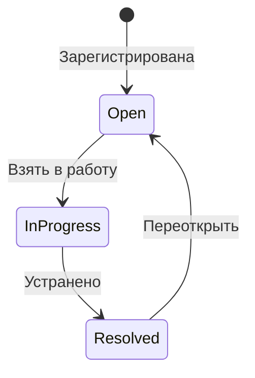

<div align="center">

# 🔍 Leak Tracker

**Полевая система учёта и контроля утечек газа**

[](https://react.dev)
[](https://vitejs.dev)
[](https://capacitorjs.com)
[](https://leafletjs.com)
[](#-офлайн-карты)

_Мобильное приложение для регистрации, мониторинга и отчётности по утечкам в нефтегазовой отрасли._  
_Работает полностью офлайн, поддерживает мультипроектность и перенос данных между устройствами._

</div>

---

## ✨ Возможности

|     | Функция                        | Описание                                                                  |
| --- | ------------------------------ | ------------------------------------------------------------------------- |
| 📋  | **Регистрация утечек**         | Многошаговая форма с фото, координатами и расчетами                       |
| 🔎  | **Повторный мониторинг**       | Обходы, повторные проверки и отдельное фото каждой записи                 |
| 🗺️  | **Офлайн-карта**               | Leaflet с локальным кэшем тайлов и кластеризацией                         |
| 🎤  | **Голосовой ввод**             | Распознавание речи с fuzzy matching и preview-подтверждением              |
| 📦  | **Импорт / Экспорт проектов**  | ZIP-бэкап с метаданными проекта и фотографиями                            |
| 🔁  | **Локальная QR-синхронизация** | Обмен ZIP-архивами между Android-устройствами в доверенной локальной сети |
| 📊  | **Excel / KML / ZIP отчёты**   | XLSX/Excel ZIP с фото, мониторингом и историей / KML / JSON / ZIP         |
| 🧩  | **Импорт Excel**               | Создание копии проекта или merge/overwrite существующего проекта          |
| 🔄  | **Lifecycle Management**       | Open → In Progress → Resolved + история изменений                         |
| 🗂️  | **База данных**                | Фильтры по статусу, приоритету, GPS-близости; bulk-действия; сортировка   |
| ✅  | **Проверка данных**            | Поиск пропущенных фото, битых ссылок, координат и дублей `leak_id`        |
| ⚙️  | **Настройки проекта**          | Обязательность фото, видимость полей, параметры расчёта, режим Excel      |
| 🌐  | **RU / EN интерфейс**          | Переключение языка основных пользовательских сценариев                    |
| 🌙  | **Темизация**                  | Поддержка dark / light mode                                               |
| 📱  | **Android Ready**              | Capacitor 8 native build                                                  |

---

## 🚀 Быстрый старт

Требуется Node.js 22 или новее (это минимальная версия для Capacitor CLI 8).

```bash
git clone <repo>
cd leak-tracking
npm install
npm run dev
```

---

## 🏗️ Технологический стек

```text
Frontend        React 19 + Vite 6
Styling         SCSS Modules / CSS Variables
Mobile          Capacitor 8
Maps            Leaflet + MarkerCluster
Storage         localStorage / IndexedDB / Filesystem
Export          ExcelJS / JSZip / KML
i18n            i18next + react-i18next
Testing         Vitest + Testing Library + Playwright
```

### 📦 Зависимости

| Категория       | Пакеты                                                                                                                |
| --------------- | --------------------------------------------------------------------------------------------------------------------- |
| **Core**        | React 19.2, React DOM 19.2, Vite 6                                                                                    |
| **Mobile**      | Capacitor 8 (android, camera, cli, core, filesystem, geolocation, share), speech-recognition, ML Kit barcode scanning |
| **Maps**        | Leaflet 1.9, Leaflet MarkerCluster 1.5                                                                                |
| **Export / QR** | ExcelJS 4.4, JSZip 3.10, QRCode 1.5                                                                                   |
| **i18n**        | i18next, react-i18next                                                                                                |
| **UI**          | clsx 2.1                                                                                                              |
| **Testing**     | Vitest, Testing Library (DOM, Jest, React, User Event), Playwright                                                    |

---

## 📁 Архитектура проекта

```text
src/
├── app/
│   ├── App.jsx
│   ├── hooks/              # useAppState, useProjectData, useTheme, useVoiceControl
│   ├── migrations/         # One-time legacy data cleanup
│   └── project/            # ProjectContext + project storage/migration/keys
│       └── hooks/          # useProjectConfig, useProjectVars, useHiddenFields, …
│
├── components/
│   ├── layout/             # Header, Footer, PageHeader (structural shells)
│   └── ui/                 # ConfirmSheet, MobileSheet, Notification, StatusBadge, ErrorBoundary
│
├── configs/
│   ├── index.js            # Barrel → PROJECT_CONFIGS, PROJECT_META
│   ├── projects.js
│   ├── projectAdapter.js
│   ├── projectLocation.config.js
│   ├── shared/             # Common fields + steps across project types
│   ├── upstream/           # UPSTREAM_CONFIG + data/fields + data/steps
│   ├── midstream/
│   └── downstream/
│
├── data/
│   ├── leak/               # fieldDictionary, statusDictionary, priorityDictionary
│   └── variables.js
│
├── features/               # Domain components — one folder per bounded context
│   ├── editTextField/
│   ├── calculationParameters/ # Shared calculation parameter form
│   ├── fieldVisibility/    # FieldVisibilityModal
│   ├── importConflict/     # Merge / overwrite / copy preview sheet
│   ├── leakDetails/        # LeakDetailsSheet + hooks + sub-components
│   ├── leakForm/           # LeakForm + LeakFormContext + hooks + Header/Footer
│   │   └── components/     # ClearActions, InputCard, StepRenderer
│   ├── leakList/           # VirtualizedLeakList, LeakCardCompact
│   ├── photos/             # PhotoViewer, PhotoInput
│   ├── resolve/            # ResolveModal
│   ├── search/             # Autocomplete (+ smartFilter)
│   ├── settings/           # SettingsModal (UI only; page logic lives in pages/Settings)
│   ├── status/             # StatusPickerModal
│   └── voice/              # VoiceButton, VoicePreviewSheet
│       └── utils/          # numbers, normalization, matching, synonyms, parseVoiceText, …
│
├── hooks/                  # Shared hooks used in 2+ features
│   ├── cameraService.js    # Co-located with sole consumer useCamera
│   ├── photoService.js
│   ├── speechService.js
│   ├── useCamera.js
│   ├── useEditablePhoto.js
│   ├── useFormDraft.js
│   ├── useGeolocation.js
│   ├── usePhotoStorage.js
│   └── …
│
├── pages/
│   ├── AddLeak/
│   ├── DataBase/           # + excel.js + hooks/ + components/
│   ├── MainPage/
│   ├── MapPage/            # + offlineMap.js + kml.js + handleExport.js + hooks/
│   ├── Monitoring/
│   ├── ProjectSetup/
│   └── Settings/           # + backup.js + hooks/ + components/
│
├── repositories/
│   ├── idb.js              # createIdbStore() factory (IndexedDB)
│   ├── LeakRepository.js
│   ├── PhotoRepository.js
│   ├── backupSchema.js     # Manual validation for ZIP import/export
│   └── compressImage.js
│
├── services/
│   ├── excelImportService.js
│   ├── localSyncService.js
│   ├── projectBackupService.js
│   ├── projectIntegrityService.js
│   ├── projectSyncState.js
│   ├── publicFileWriter.js
│   └── maps/tileCache.js   # Shared tile-caching logic
│
├── utils/
│   ├── calculations/       # Emissions & flow-rate calculations
│   ├── normalize/          # capitalizeFirst, normalizeNumber, parseNumericInput
│   ├── geoUtils.js
│   ├── haptics.js
│   ├── photoConversion.js
│   ├── platform.js
│   ├── priority.js
│   ├── status.js
│   └── timeAgo.js
│
├── index.jsx               # App entry point
├── index.scss              # Global CSS variables + base styles
└── reportWebVitals.js
```

> **Placement rule (hook / service / util):** co-locate with the single consumer;
> promote to `src/hooks/` / `src/services/` / `src/utils/` only when used by 2+
> unrelated features. Consumer count = 0 → delete. See `CONTRIBUTING.md`.

---

## 🗂️ Поддерживаемые типы проектов

| Тип        | Назначение                 |
| ---------- | -------------------------- |
| Upstream   | Добыча                     |
| Midstream  | Транспортировка и хранение |
| Downstream | Переработка / Сбыт         |

Каждый тип проекта использует собственную схему полей, форму ввода и экспортный шаблон.

---

## 📊 Модель объекта утечки

```ts
interface LeakRecord {
  id: number;
  lat: number;
  lng: number;
  status: "open" | "in_progress" | "resolved";
  leak_id?: string | number;
  component?: string;
  leak_description?: string;
  photo?: string | null;
  photo_after?: string | null;
  photo_repair?: string | null;
  monitoringRecords?: MonitoringRecord[];
  priority?: "low" | "medium" | "high" | "critical";
  updatedAt?: number;
  resolvedAt?: number;
  // ... дополнительные поля (project-specific)
}

interface LeakHistoryEntry {
  action: "created" | "status_changed" | "edited" | "comment" | "monitoring";
  to?: string; // для status_changed
  text?: string; // для comment
  date: string; // ISO date
}

interface MonitoringRecord {
  id: string;
  date: string;
  roundId?: string;
  roundNumber?: number;
  monitoredBy?: string;
  result: "still_leaking" | "needs_recheck" | "resolved";
  photo?: string | null;
  materials_equipment?: string;
  comment?: string;
}
```

---

## 📦 Импорт / Экспорт

Проект поддерживает перенос данных между устройствами через ZIP-архив:

```text
Export ZIP
├── project.json        # Метаданные проекта (schemaVersion, name, type, vars, settings)
├── backup.json         # Все записи утечек
└── photos/             # Исходные, ремонтные, итоговые и мониторинговые фото
```

При импорте автоматически:

- тип проекта определяется из `project.json` или автоматически по полям записей;
- создаётся новый проект и активируется;
- восстанавливаются записи, фотографии, фильтры, переменные расчётов и активный обход мониторинга;
- инициализируется локальное хранилище.

### Excel и журнал мониторинга

В настройках проекта, в блоке **«Поля формы и Excel»**, можно выбрать режим
экспорта журнала мониторинга:

- **Полная история** — в Excel попадает каждая проверка, включая повторные записи;
- **Последняя запись в обходе** — для каждого тега экспортируется только последняя
  проверка в каждом обходе.

В листе **«Утечки»** предусмотрены отдельные ссылки на исходное фото, фото ремонта
и итоговое фото. Все фотографии повторных проверок находятся на листе
**«Мониторинг»**, по одной ссылке на запись. Файлы изображений лежат рядом с XLSX
в экспортируемом ZIP, поэтому Excel и каталог `photos/` нужно переносить вместе.

### Повторный мониторинг

Каждый обход имеет собственный номер. Повторный свайп уже проверенной карточки
предлагает начать новый раунд. Каждая проверка хранит свой результат, исполнителя,
комментарий, материалы и отдельную фотографию. Последнее мониторинговое фото
показывается в миниатюре карточки и в подробной карточке утечки.

### Локальная QR-синхронизация

На Android доступна синхронизация проекта между устройствами без облака:

```text
Устройство A
  ├─ готовит ZIP-архив проекта
  ├─ создаёт одноразовый QR с sessionId и сроком действия 3 минуты
  ├─ подтверждает каждое подключение второго устройства
  └─ принимает архив или передаёт копию базы

Устройство B
  ├─ сканирует QR
  ├─ ожидает подтверждения на устройстве A
  ├─ отправляет свой ZIP при синхронизации
  └─ получает архив устройства A
```

QR-синхронизация использует тот же формат ZIP-бэкапа и те же проверки, что
обычный импорт. Для защиты от случайного объединения разных баз используется
`syncId`; старые проекты без `syncId` получают его при первом запуске
синхронизации. QR-сеанс автоматически закрывается после первой успешной передачи;
перед запуском можно разрешить импорт на несколько устройств. На экране источника
отображаются оставшееся время и количество завершённых передач. Также доступен режим
**импорта по QR** на первом экране: устройство скачивает архив по QR и создаёт проект
без отправки локальной базы.

История удалений автоматически уплотняется при большом количестве записей. При
этом создаётся новая синхронизационная эпоха. Если давно не подключавшееся
устройство содержит старую эпоху, автоматическое объединение блокируется, чтобы
не восстановить уже удалённые утечки. В таком случае необходимо экспортировать
полный ZIP с актуального устройства и заменить проект на втором устройстве.

---

## ✅ Проверка данных проекта

В настройках есть блок **«Проверка данных»**. Он анализирует текущий проект и
показывает:

- записи без исходного фото;
- записи без фото ремонта / итогового фото;
- мониторинговые записи без фото;
- битые ссылки на фотографии;
- записи без координат;
- дубли `leak_id`.

Проверка учитывает настройки обязательности фото, поэтому проект может разрешать
мониторинг или регистрацию без фотографии там, где это включено в настройках.

---

## 🗺️ Офлайн-карты

```text
Tile Request
   ↓
Network Available?
 ├─ Yes → Cache Tile
 └─ No  → Load From Cache
```

Поддерживается кэширование карт для работы в полностью изолированных сетях.

---

## 🗂️ База данных (DataBase)

Страница со списком всех утечек проекта:

- **Поиск** по ID, объекту, описанию
- **Фильтры**: статус (Open / In Progress / Resolved), приоритет (Low / Medium / High / Critical), GPS-фильтр «Рядом со мной»
- **Сортировка** по дате (новые / старые)
- **Bulk-действия**: выбор нескольких записей, массовое изменение статуса, последовательное закрытие с фото
- **Экспорт** отфильтрованного набора в XLSX / KML / ZIP

---

## 🔒 Приватность

- Все данные хранятся локально на устройстве
- Нет серверной части / облака / телеметрии
- Подходит для air-gapped environments
- QR-синхронизацию следует запускать только в доверенной локальной сети
- QR содержит временный `sessionId`, действует 3 минуты и требует подтверждения на устройстве-источнике

---

## 📱 Сборка и запуск на телефоне

### Android

Для Android-сборки нужен **JDK 21**. Можно использовать JBR, встроенный в Android
Studio:

```powershell
$env:JAVA_HOME="C:\Program Files\Android\Android Studio\jbr"
$env:Path="$env:JAVA_HOME\bin;$env:Path"
npm run build
npm run cap:sync
npx cap open android
```

В Android Studio подключите устройство или эмулятор и нажмите **Run**.

Для сборки debug APK из PowerShell:

```powershell
cd android
.\gradlew.bat assembleDebug
```

APK будет создан в `android/app/build/outputs/apk/debug/app-debug.apk`.

#### Название приложения

1. Измените `appName` в `capacitor.config.ts`.
2. Измените `app_name` и `title_activity_main` в
   `android/app/src/main/res/values/strings.xml`.
3. Выполните `npm run cap:sync` и пересоберите приложение.

`appId` (`com.leak.tracking`) — это идентификатор пакета, а не видимое название.
Не меняйте его только ради переименования: после публикации Google Play считает
другой `appId` другим приложением.

#### Иконка приложения

Подготовьте квадратный PNG, желательно **1024 × 1024 px**, оставив безопасные поля
вокруг логотипа. Затем в Android Studio:

1. Откройте каталог `android` командой `npx cap open android`.
2. Нажмите правой кнопкой на `app/src/main/res` → **New → Image Asset**.
3. Выберите **Launcher Icons (Adaptive and Legacy)**.
4. Укажите PNG для foreground, цвет или изображение background и имя
   `ic_launcher`.
5. Нажмите **Next → Finish** и пересоберите приложение.

Android Studio обновит варианты `mipmap-*` и круглую adaptive-иконку; manifest уже
ссылается на `@mipmap/ic_launcher` и `@mipmap/ic_launcher_round`. Если после
переустановки видна старая иконка или подпись, удалите предыдущую версию приложения
с телефона и установите APK заново. Splash screen настраивается отдельно.

### iOS

```bash
npm run build
npx cap sync ios
npx cap open ios
```

Далее открыть проект в Xcode и выполнить build на устройство.

---

## ⚙️ Production Deployment Notes

- Release-сборка Android использует R8, shrinking ресурсов и проектные ProGuard-правила
- Для iOS — настроить permissions в Info.plist
- Перед релизом прогнать `npm run lint`, `npm test`, `npm run test:e2e`,
  `npm run test:perf`, `npm run android:release` и проверку APK на реальном устройстве
- Проверить QR-синхронизацию, камеру, GPS, экспорт/импорт ZIP и Excel на
  реальном Android-устройстве
- Не хранить тестовые проекты и dev-логи в релизной сборке
- Для объектов с чувствительными координатами задавать `VITE_TILE_URL` на
  одобренный или собственный tile server: координаты запросов тайлов раскрывают
  просматриваемую область внешнему провайдеру
- Для публикации в подпапке задавать `VITE_BASE_PATH`, например
  `/leak-tracking/`; manifest и service worker используют тот же scope

---

## 📜 Скрипты

```bash
npm run dev          # Development server
npm run build        # Production build
npm run preview      # Preview production build
npm test             # Vitest unit / integration tests
npm run test:coverage # Vitest with coverage
npm run test:e2e     # Playwright smoke/e2e tests
npm run test:perf    # Production build + large dataset performance tests
npm run lint         # ESLint
npm run format:check # Prettier check
npm run typecheck    # TypeScript contracts gate
npm run cap:sync     # Sync Capacitor и Android Gradle patch
npm run verify:release # Полный web release-gate
npm run android:release # Release APK с R8 и lintRelease
npm run pack:source  # Чистый source ZIP + проверка через npm ci и lint
```

Для подписанной Android release-сборки должны быть заданы переменные окружения:

```text
ANDROID_KEYSTORE_PATH
ANDROID_KEYSTORE_PASSWORD
ANDROID_KEY_ALIAS
ANDROID_KEY_PASSWORD
ANDROID_VERSION_CODE
ANDROID_VERSION_NAME
```

`npm run android:release` завершается ошибкой до сборки, если keystore или одна
из обязательных переменных отсутствует. `ANDROID_VERSION_CODE` должен быть
положительным целым числом (и увеличиваться при каждой публикации), а
`ANDROID_VERSION_NAME` — явной версией релиза, например `1.4.0`. Любая Gradle
задача с `Release` также отклоняет отсутствующую или некорректную версию. CI
может продолжать собирать неподписанный `assembleRelease` напрямую только как
проверочный артефакт, но тоже обязан передать обе переменные версии.

### Performance tests

Производительные сценарии вынесены отдельно в `performance/` и не входят в
обычный `npm test`. По умолчанию `npm run test:perf` проверяет проекты на 1 000
и 10 000 записей: cold start, открытие базы, поиск, bulk-save, Excel export /
import preview, heap usage и количество отрендеренных карточек. Размер набора
можно задать переменной:

```powershell
$env:PERF_RECORDS="10000"
npm run test:perf
```

---

## 🧭 Архитектурная диаграмма


---

## 🔄 State Machine: Leak Lifecycle



---

## 🏆 Архитектурные особенности

- **Offline-First Core** — приложение полностью функционально без сети
- **Project Isolation** — каждый проект хранится в отдельном namespace
- **Portable Backup System** — перенос проекта одним ZIP-файлом
- **Local QR Sync** — обмен проектами между Android-устройствами без облака
- **Extensible Config Architecture** — новые project types добавляются конфигом
- **Project-aware Excel Import** — импорт собственного Excel ZIP с фото,
  мониторингом и preview конфликтов
- **Data Integrity Checks** — встроенная проверка полноты и ссылок на фото
- **Native Device Integration** — Camera / Filesystem / Geolocation / Speech API

---

## 📈 Roadmap

- [ ] Cloud Sync / Optional Backend Mode
- [ ] Multi-user Collaboration
- [ ] Advanced Analytics Dashboard
- [ ] GIS Layer Import / Overlay Support
- [ ] Enterprise Audit Trail / Signatures
- [ ] PDF summary reports
- [ ] Equipment registry / asset history
- [ ] SLA deadlines and repair acts

---

## 🤝 Для кого создан проект

- LDAR / Methane Management Teams
- Field Inspectors
- Compressor Station Operators
- Environmental Compliance Engineers
- Oil & Gas Asset Integrity Teams

---

<div align=\"center\">

**Industrial-grade leak management platform for field operations.**

</div>
