# Руководство пользователя — Leak Tracker

Полевая система учёта утечек газа. Приложение работает полностью офлайн: все
данные и фотографии хранятся на самом устройстве, сервера и облака нет.

Скриншоты сняты на мобильном экране в русском интерфейсе. Экраны Android-сборки
и веб-версии совпадают; отличия отмечены отдельно.

> Для Android есть отдельное руководство, снятое на самом устройстве:
> [manual/android/manual.html](manual/android/manual.html). Там разобраны
> установка APK, разрешения, камера, папки на телефоне и передача базы по QR.
> Как получить из него PDF — [ниже](#руководство-по-android).

---

## Содержание

1. [Первый запуск: проект](#1-первый-запуск-проект)
2. [Профиль пользователя](#2-профиль-пользователя)
3. [Главный экран](#3-главный-экран)
4. [Добавление утечки](#4-добавление-утечки)
5. [Карточка утечки](#5-карточка-утечки)
6. [Статусы: ремонт, устранение, переоткрытие](#6-статусы-ремонт-устранение-переоткрытие)
7. [Выбор объекта](#7-выбор-объекта)
8. [База данных](#8-база-данных)
9. [Мониторинг: обходы](#9-мониторинг-обходы)
10. [Реестр компонентов и схемы](#10-реестр-компонентов-и-схемы)
11. [Карта](#11-карта)
12. [Настройки](#12-настройки)
13. [Перенос данных: ZIP, Excel, QR](#13-перенос-данных-zip-excel-qr)
14. [Тема и язык](#14-тема-и-язык)
15. [Частые вопросы](#15-частые-вопросы)
16. [Справочник](#16-справочник)

---

## 1. Первый запуск: проект

При первом открытии приложение просит создать проект. Проект — это отдельный
журнал: свои утечки, свои фото, свои настройки и своя папка на устройстве.

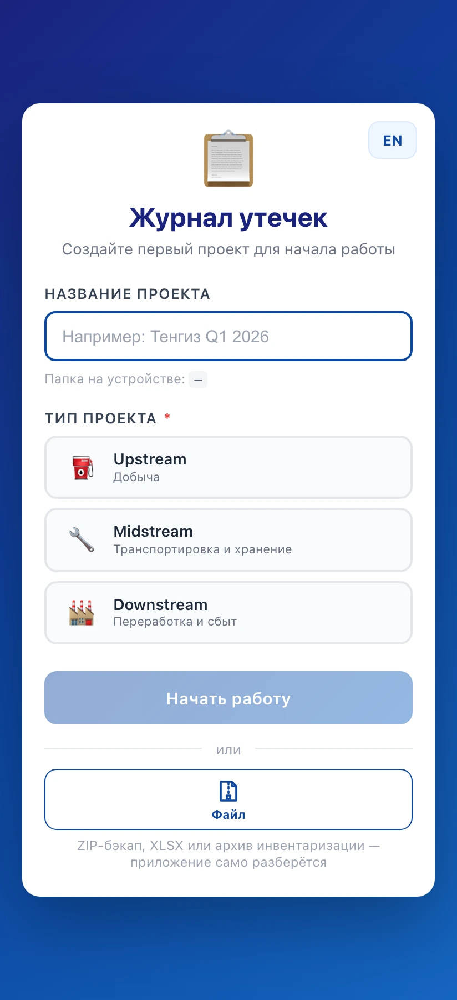

Что нужно сделать:

1. Ввести **название проекта** (например, `Тенгиз Q1 2026`). Ниже показывается,
   какая папка будет создана на устройстве.
2. Выбрать **тип проекта** — он определяет набор полей формы, уровни локации и
   шаблон экспорта:

   | Тип            | Назначение                 | Уровни локации                          |
   | -------------- | -------------------------- | --------------------------------------- |
   | **Upstream**   | Добыча                     | Подразделение → Месторождение → Локация |
   | **Midstream**  | Транспортировка и хранение | УМГ → Станция → Локация                 |
   | **Downstream** | Переработка и сбыт         | Район → Населённый пункт → Адрес        |

3. Нажать **«Начать работу»**.

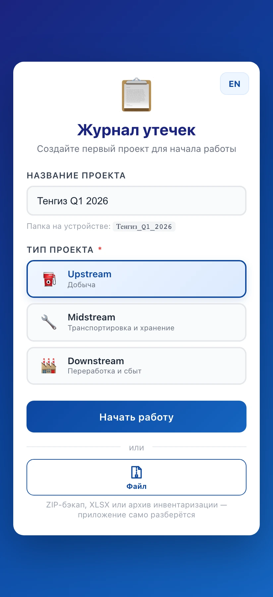

> **Тип проекта менять нельзя.** Он определяет структуру данных, поэтому
> выбирайте его один раз и осознанно.

Вместо создания пустого проекта на этом же экране можно **импортировать** уже
существующий. Кнопка **«Файл»** принимает ZIP-бэкап, Excel-файл (XLSX или Excel
ZIP) и архив инвентаризации — что именно принесли, приложение определяет само.
Кнопка **QR** забирает базу с другого телефона. Подробности — в разделе
[«Перенос данных»](#13-перенос-данных-zip-excel-qr).

После создания проекта открывается главный экран. Пока записей нет — приложение
предлагает добавить первую утечку.

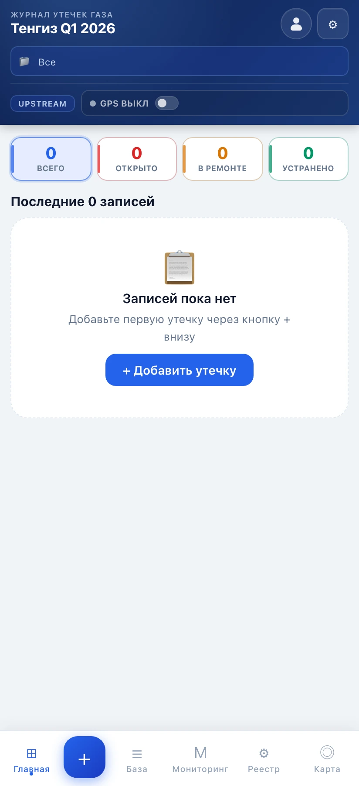

---

## 2. Профиль пользователя

Имя из профиля автоматически подставляется во все действия: кто зарегистрировал
утечку, кто взял её в ремонт, кто провёл проверку при обходе.

Откройте профиль кружком с инициалом в шапке.

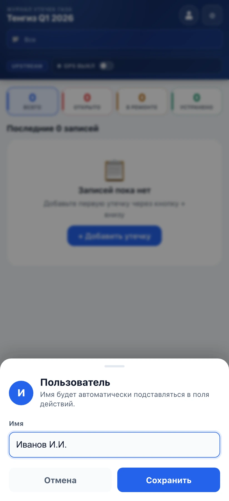

> **Заполните имя до начала работы.** Без него сохранение утечки и запись
> результата мониторинга блокируются сообщением «Заполните имя пользователя в
> профиле».

---

## 3. Главный экран

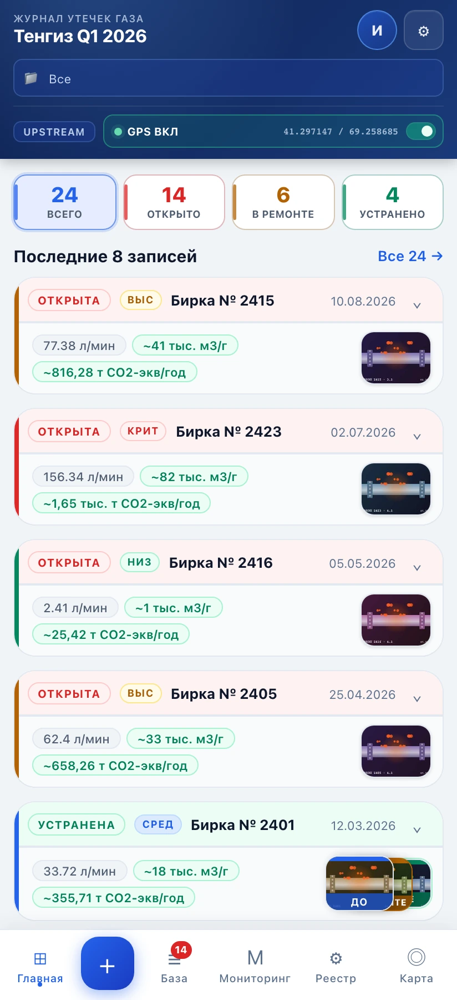

**Шапка (сверху вниз):**

- название активного проекта, кружок профиля, шестерёнка настроек;
- кнопка **выбора объекта** — показывает текущий путь (`Все`, если ограничения
  нет), см. раздел [7](#7-выбор-объекта);
- бейдж типа проекта и переключатель **GPS** с текущими координатами.

**Плитки статистики** — «Всего», «Открыто», «В ремонте», «Устранено». Это не
только счётчики, но и фильтр: нажатие на плитку оставляет в списке ниже только
записи этого статуса, повторное нажатие снимает фильтр.

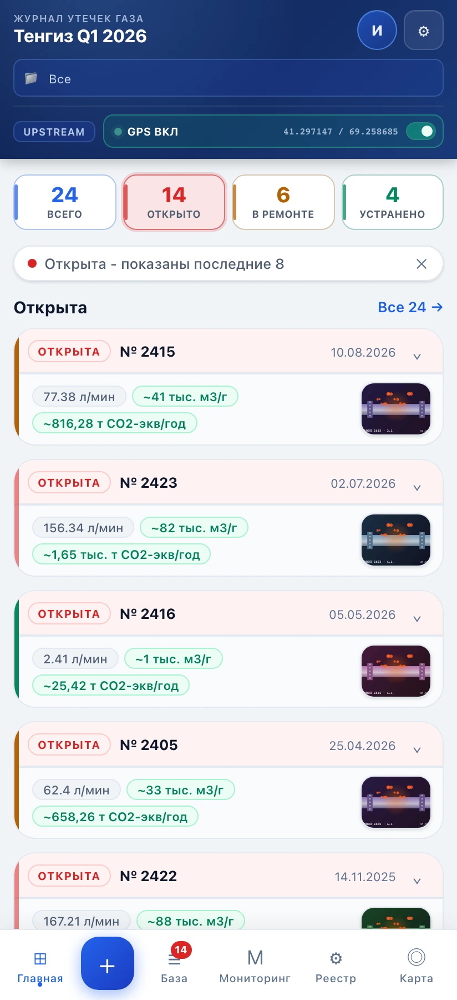

**Последние записи** — свежие утечки по времени изменения. Ссылка «Все N →»
открывает Базу данных.

**Нижняя панель** (слева направо): Главная, кнопка **+** (добавить утечку),
База, Мониторинг, Карта. На кнопке «База» показан счётчик открытых утечек в
текущей области.

---

## 4. Добавление утечки

Кнопка **+** внизу экрана открывает форму. Форма многошаговая; номер шага виден
в шапке.

### Шаг 1. Основное

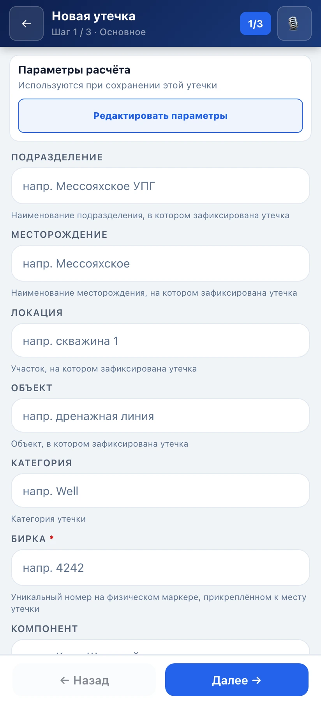

Здесь заполняются место (три уровня локации), объект, категория, бирка,
компонент, номер видео, давление, температура и измеренная скорость утечки.
Большинство полей — автодополняемые: приложение подсказывает значения из
справочника и из ранее введённых записей.

Перед первой записью проверьте **параметры расчёта** — кнопка «Редактировать
параметры». Они участвуют в расчёте потерь и выбросов для этой утечки.

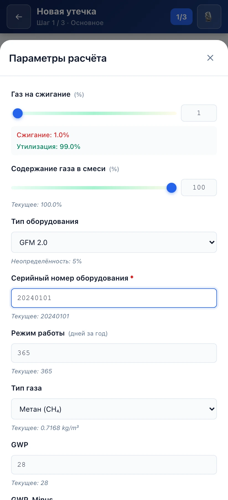

Параметры: тип оборудования (GFM 2.0 / GFM 3.0 / Розовый мешок), серийный номер
прибора, погрешность, тип газа, плотность, доля газа на сжигание и на
утилизацию, содержание газа в смеси, режим работы (дней в году).

> **Серийный номер обязателен.** Без него утечка не сохранится.

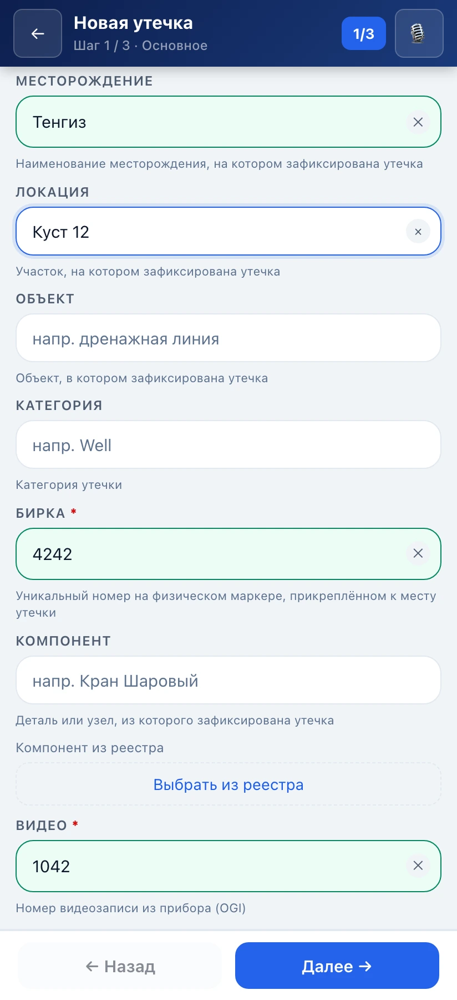

**Голосовой ввод.** Кнопка микрофона в шапке формы распознаёт речь и
раскладывает сказанное по полям. Перед применением показывается окно
подтверждения — можно проверить, что распознано, и отказаться.

### Шаг 2. МТР и описание

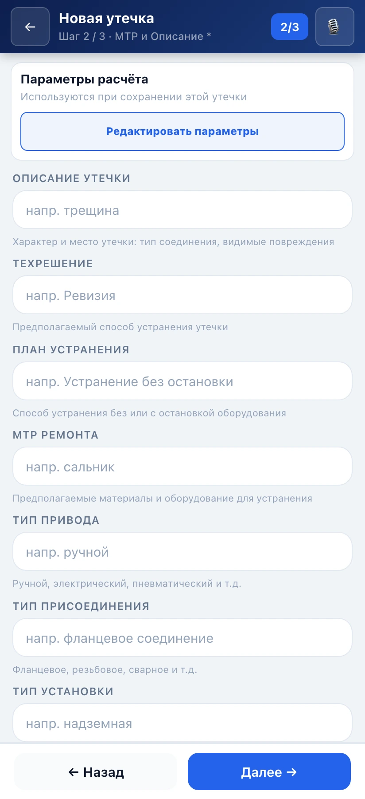

Описание утечки, техническое решение, план устранения, МТР ремонта, тип привода,
тип присоединения и тип установки. Все поля — со списками готовых формулировок.

### Шаг 3. Примечание и фото

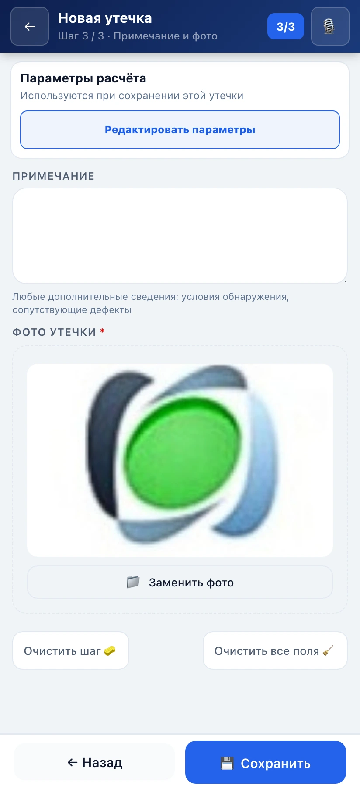

Примечание и фотография утечки: **«Камера»** снимает сразу, **«Галерея»**
выбирает готовый файл. Обязательность фото настраивается в настройках проекта.

Кнопка **«Сохранить»** записывает утечку.

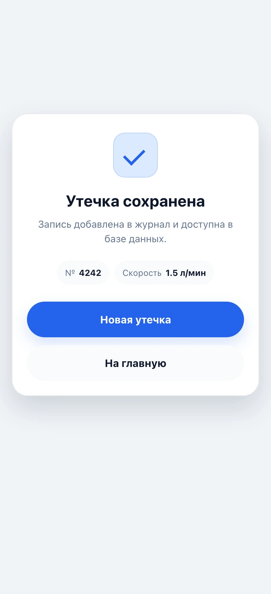

**Координаты.** Если в момент сохранения координат нет, приложение само включает
GPS и ждёт первого фикса до 15 секунд. Дождались — координаты записываются.
Не дождались — утечка сохраняется без них, и об этом появляется уведомление:
такая запись найдётся в базе, но не появится на карте.

**Черновик.** Незаконченная форма не теряется: при следующем открытии появляется
баннер «Есть незаконченная запись» с выбором «Восстановить» или «Удалить».

---

## 5. Карточка утечки

Карточка в списке показывает статус, приоритет, номер бирки, дату, место,
компонент, скорость утечки и расчётные потери. Стрелка справа разворачивает и
сворачивает подробности.

**Свайп вправо** открывает подробную карточку.

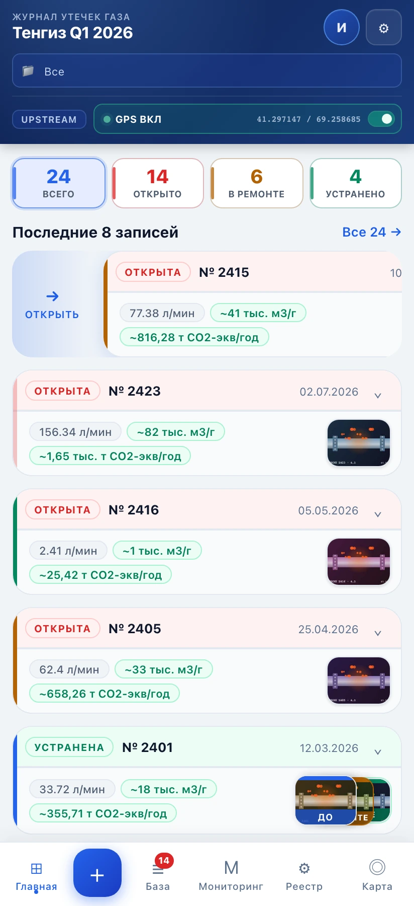

**Свайп влево** открывает смену статуса (на экране «Мониторинг» — запись
проверки).

### Подробная карточка

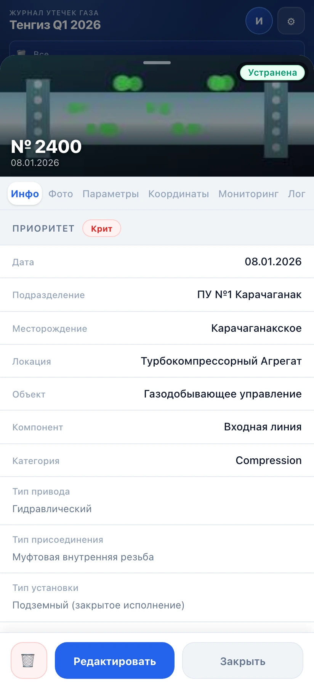

Вкладки:

| Вкладка        | Содержимое                                                              |
| -------------- | ----------------------------------------------------------------------- |
| **Инфо**       | приоритет, дата, место, объект, описание — основные поля записи         |
| **Фото**       | фото до, фото ремонта, фото после; нажатие открывает просмотрщик        |
| **Параметры**  | замеры и расчётные величины: потери метана, выбросы CO₂-экв             |
| **Координаты** | широта и долгота                                                        |
| **Мониторинг** | все проверки по обходам: результат, исполнитель, МТР, комментарий, фото |
| **Лог**        | история записи: создание, смены статуса, правки, комментарии            |

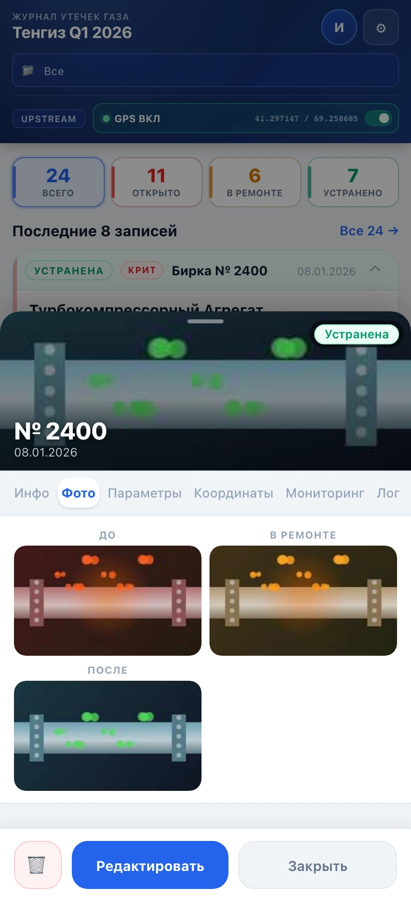
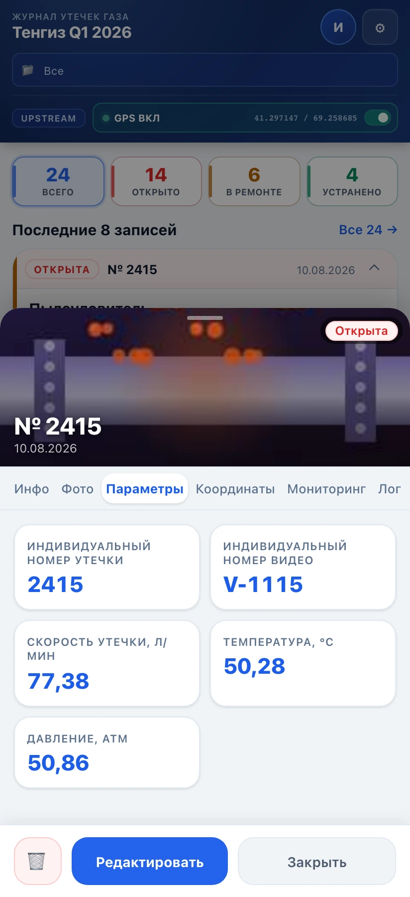
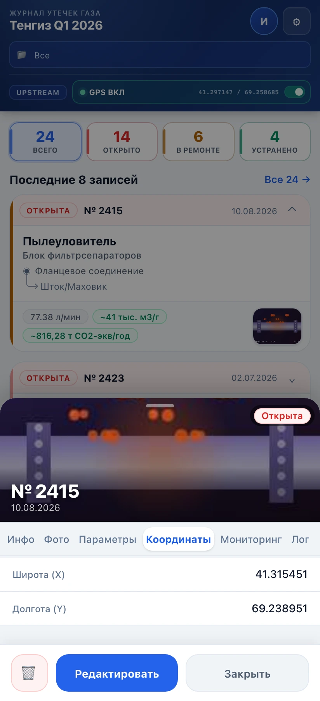
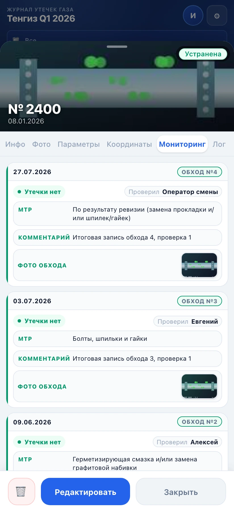
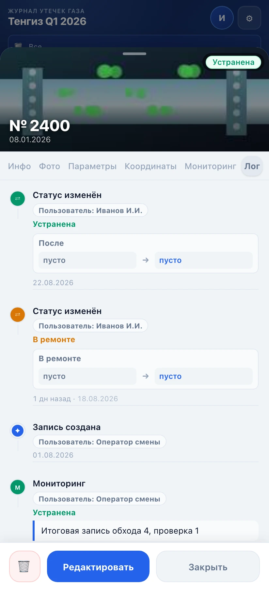

Внизу карточки — **«Редактировать»** (правка полей с сохранением в лог),
**«Закрыть»** и корзина (удаление записи с подтверждением).

---

## 6. Статусы: ремонт, устранение, переоткрытие

Утечка живёт по замкнутому циклу:

```text
Открыта ──► В ремонте ──► Устранена ──► (переоткрытие) ──► Открыта
```

Кнопка статуса в подробной карточке (или свайп влево по карточке в списке)
открывает выбор. Предлагается **ровно один переход — следующий по циклу**:
статус нельзя перескочить.

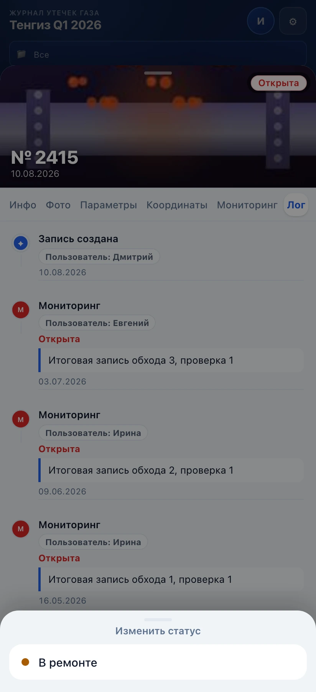

**Взять в ремонт.** Открывается окно «Утечка в ремонте»: фото ремонта, МТР и
примечание.

**Устранить.** Окно «Устранение утечки»: фото после устранения, использованные
материалы и примечание.

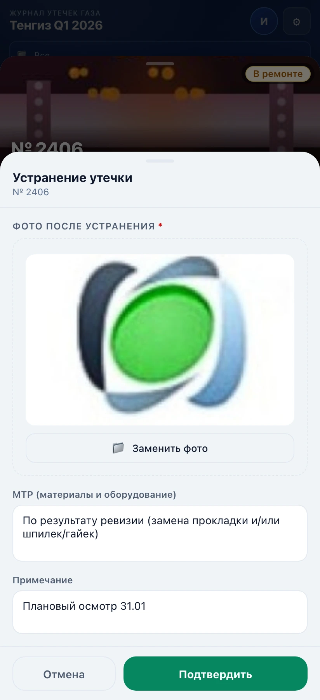

**Переоткрыть.** Для устранённой утечки открывается окно повторного открытия:
можно скопировать прежние замеры или ввести новые (скорость, давление,
температура) и при необходимости изменить параметры расчёта. Пустое поле
сохраняет прежнее значение.

Каждое действие пишется в лог утечки вместе с именем пользователя и временем.

---

## 7. Выбор объекта

Кнопка с текущим путём в шапке открывает навигацию по локациям — как по папкам в
проводнике. Рядом с каждой папкой указано число утечек внутри.

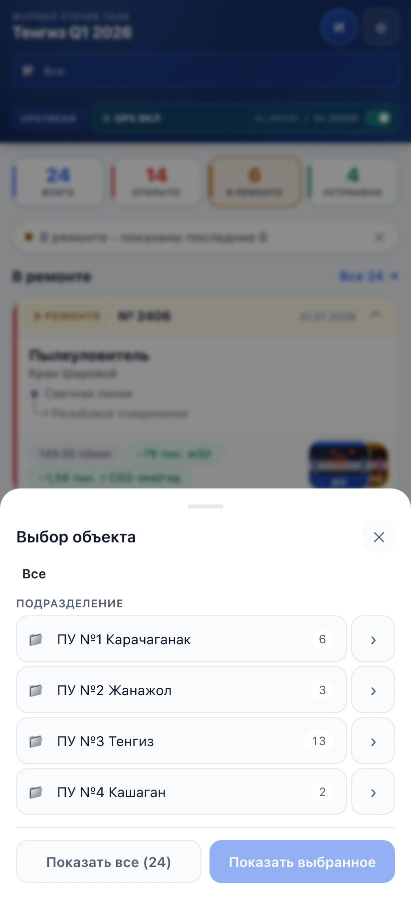

Выбранная область действует **на все экраны сразу**: Базу, Карту, Мониторинг,
статистику на Главной и счётчик на кнопке «База». Кнопка «Показать все»
возвращает весь проект.

> Область влияет только на то, что видно. Запись всегда идёт в полный список
> проекта, поэтому сохранение утечки внутри папки ничего не удаляет за её
> пределами.

Выбор области сохраняется между запусками приложения.

---

## 8. База данных

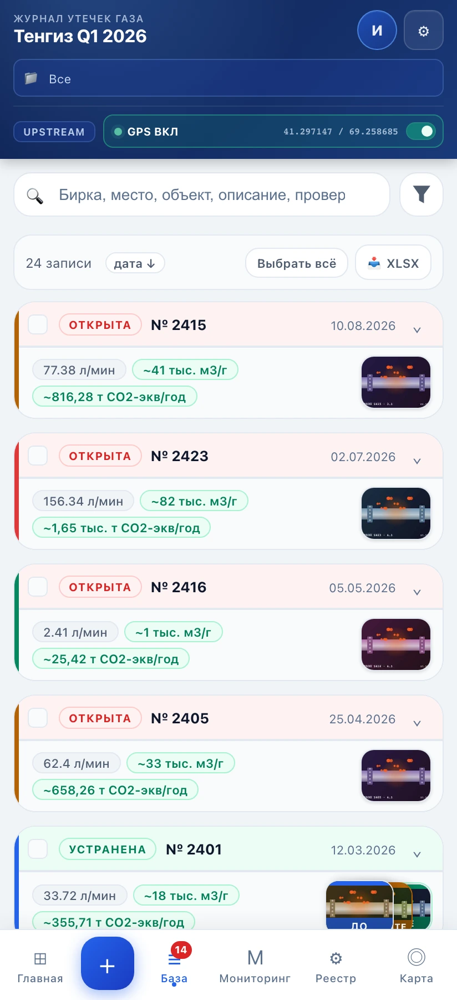

Полный список утечек проекта в текущей области.

**Поиск** — по бирке, месту, объекту, описанию, проверяющему.

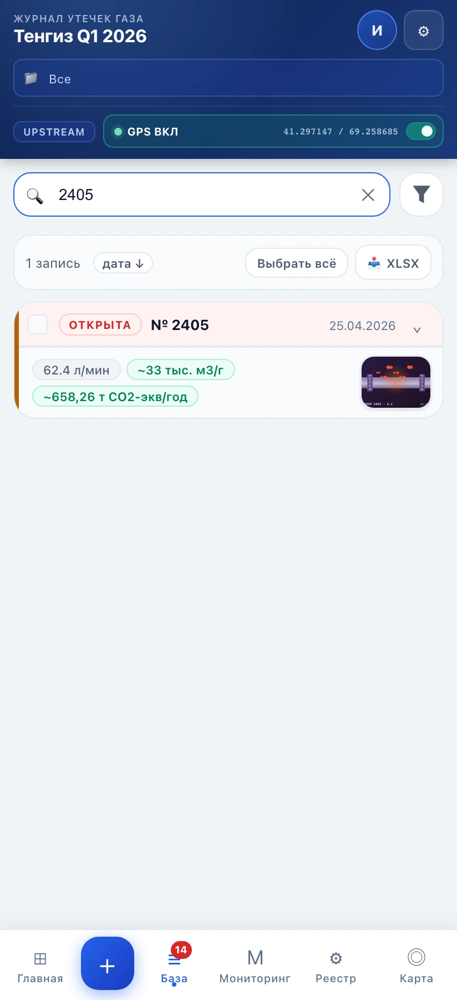

**Фильтры** (кнопка воронки): статус, приоритет и «Рядом со мной» — отбор по
расстоянию от текущей точки GPS с настраиваемым радиусом.

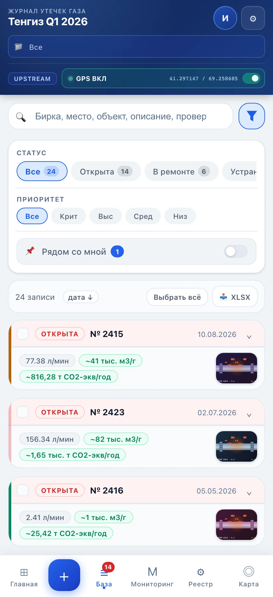

**Сортировка** — переключатель «дата ↓ / дата ↑» в строке результатов.

**Массовые действия.** «Выбрать всё» или отметка чекбоксов на карточках включает
режим выбора: показывается «N выбрано из M», доступна кнопка «Параметры
расчёта» — пересчёт выбранных записей по параметрам первой из них.

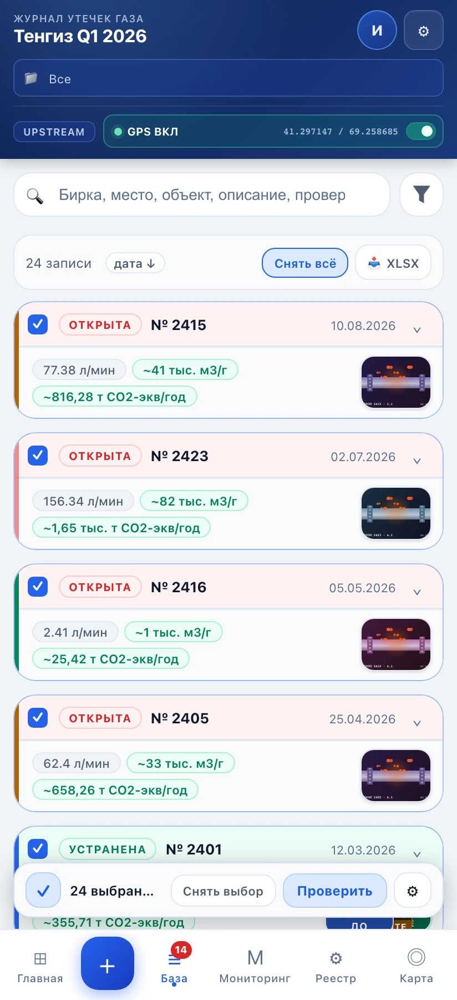

**Экспорт XLSX.** Кнопка `XLSX` выгружает текущую выборку в Excel-архив: книгу с
листами «Утечки», «История» и «Мониторинг» и папку `photos/` со всеми
фотографиями. Excel и папку с фото нужно переносить вместе — в книге лежат
ссылки на файлы.

---

## 9. Мониторинг: обходы

Мониторинг — это повторные проверки уже зарегистрированных утечек. Проверки
объединяются в **обходы**, каждый со своим номером.

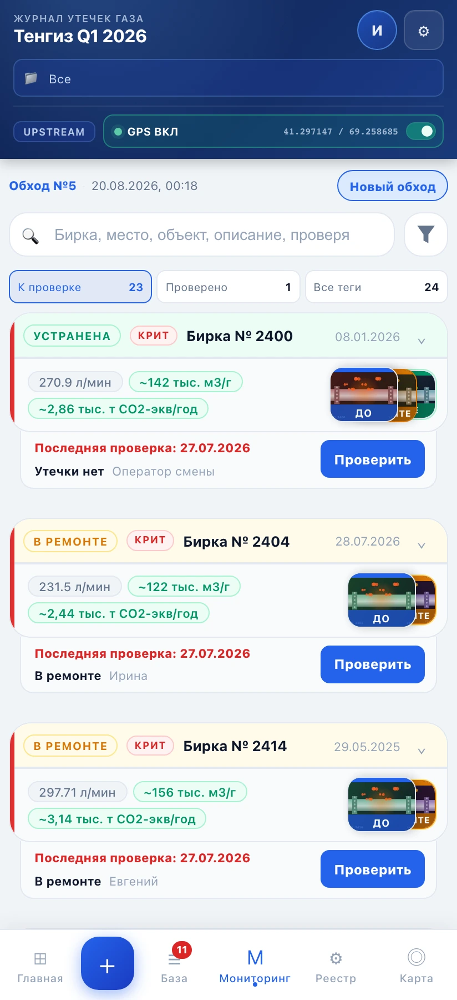

Если активного обхода нет, экран предлагает **«Начать мониторинг»**; если обход
уже идёт — кнопка называется **«Новый обход»**. В обоих случаях приложение
спрашивает подтверждение: список к проверке формируется заново, а уже
сохранённые результаты остаются в истории утечек.

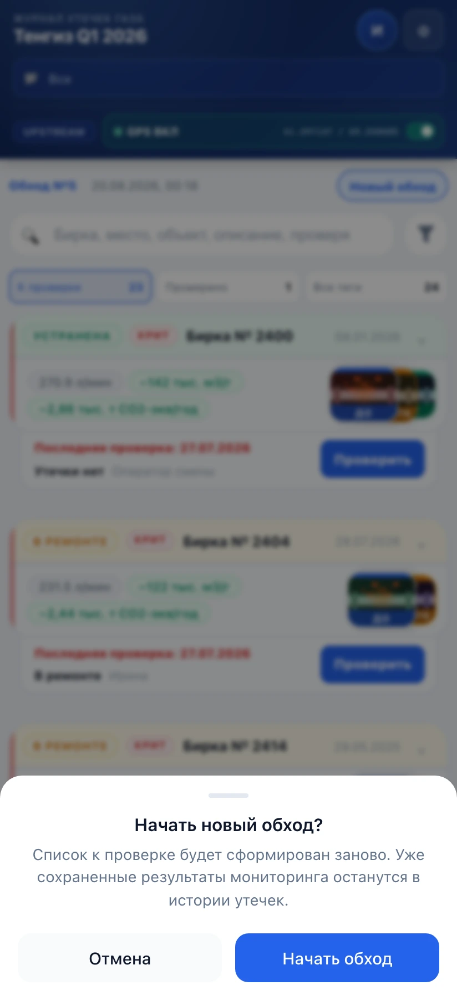

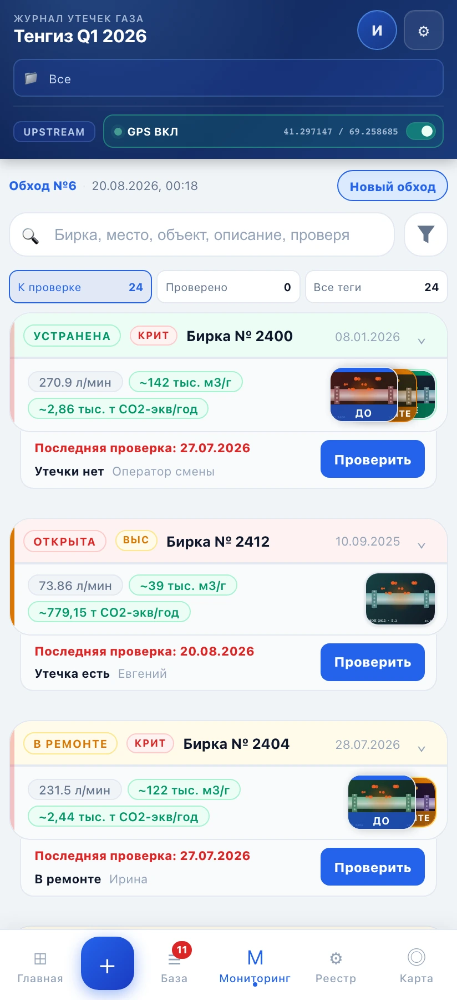

В шапке — номер и дата обхода, кнопка «Новый обход». Три фильтра:
**«К проверке»**, **«Проверено»**, **«Все теги»** — с количеством в каждом.
На карточке видно дату последней проверки, её результат и кто проверял.

**«Проверить»** (или свайп влево по карточке) открывает окно проверки:

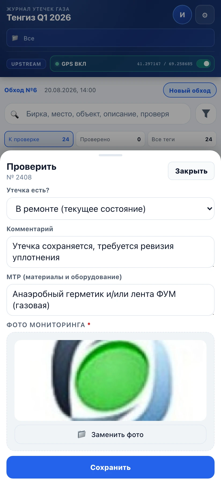

- **«Утечка есть?»** — текущее состояние: открыта / в ремонте / устранена;
- **МТР** и **комментарий**;
- **фото мониторинга** — отдельное для каждой проверки.

После сохранения тег переезжает в «Проверено», а последнее фото мониторинга
становится миниатюрой карточки.

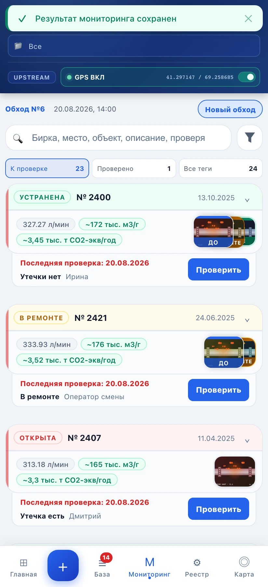

Когда проверены все теги, появляется **«Завершить обход»**. Повторная проверка
уже проверенного тега в том же обходе возможна — приложение спросит, выполнить
повторную проверку или начать новый обход.

---

## 10. Реестр компонентов и схемы

Реестр — это **инвентаризация железа**, отдельная от учёта утечек. Утечка это
событие, а компонент — то, на чём оно происходит: задвижка, вентиль, манометр.
Сколько их на месторождении, обычно не знает никто, и реестр рождается прямо в
поле: обходчик находит железо, присваивает ему номер, заполняет карточку и
фотографирует.

Открывается кнопкой **«Реестр»** в нижней навигации.

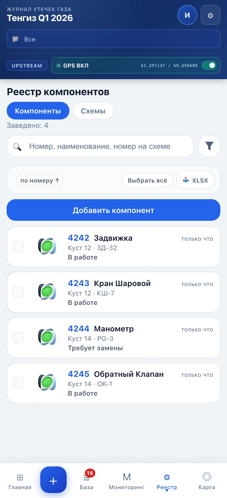

> Вкладка есть у всех трёх типов проекта. Раньше реестр вёл только Upstream, и
> у остальных кнопки в навигации не было.

### Список

Сверху две вкладки — **«Компоненты»** и **«Схемы»**, ниже строка поиска с
кнопкой фильтра, полоса результатов и список карточек.

На карточке: номер, наименование, место, номер на схеме, состояние и — справа
сверху — когда это железо в последний раз видели. Если компонент осматривали,
показывается дата осмотра, а не заведения: карточку заводят однажды, а обходят
её потом годами.

Свайпы те же, что у карточки утечки:

- **влево** — осмотр: отметить, в каком состоянии железо застали;
- **вправо** — открыть карточку целиком.

**Фильтр** (кнопка справа от поиска) отбирает по состоянию — причём только по
тем состояниям, которые реально встречаются в реестре, включая написанные от
руки, — по совпавшим номерам и по кругу **«Рядом со мной»**. При включённом
круге на карточке появляется значок с расстоянием до железа.

Включённый отбор виден по цвету: кнопка фильтра становится синей — текст, рамка,
подложка и счётчик. Так же подсвечиваются фильтры в Базе — кроме тех, у которых
есть свой цвет: зелёная «Устранена» остаётся зелёной.

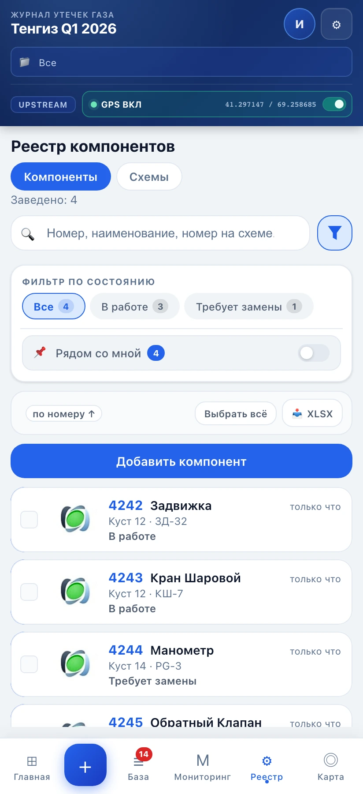

**Полоса результатов** меняет порядок (по номеру ↑ / ↓), позволяет выбрать все
показанные и выгрузить инвентаризацию кнопкой **XLSX**. Счётчика в ней нет:
сколько железа заведено, написано в шапке экрана (`Заведено: N`), а при
включённом отборе туда же добавляется `показано N`.

**Выбор нескольких** — отметками на карточках. Внизу появляется полоса с числом
выбранных и кнопкой **«Сменить статус»**: подряд стоящее железо осматривают
разом и находят в одном состоянии. Каждая карточка всё равно получает свою
подпись и своё время осмотра.

### Карточка компонента

**«Добавить компонент»** открывает форму из четырёх шагов, устроенную как форма
утечки: первый шаг спрашивает то, что видно с места, дальше идут паспортные
данные с таблички, последним — фотография.

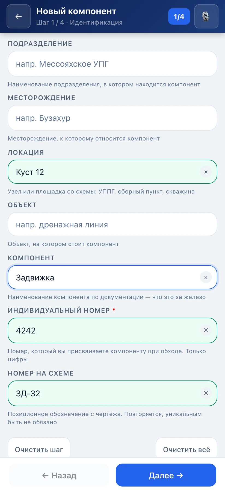

Обязательны только два поля: **индивидуальный номер** (цифры, которые
присваивает обходчик) и **фотография**. Всё остальное можно оставить пустым —
табличка бывает стёрта, закрашена или спрятана под изоляцией, и это не повод
останавливать обход.

> Приложение **предупреждает** о повторе номера, но не запрещает его: диапазоны
> номеров никто не раздаёт, чужие номера с других телефонов не видны, и решение
> остаётся за людьми. Совпадения разбираются при сведении баз.

Поля, оставленные пустыми, подсвечиваются серым значением из предыдущей
карточки — обход однообразен, и чаще всего это «здесь так же». Написанным оно
не становится, пока его не примут.

**Голос** (кнопка микрофона в шапке) заполняет карточку целиком: место, тип,
диаметр и давления (в том числе «ду 400 ру 16»), среду, материал корпуса,
завод, состояние. Распознанное показывается списком на подтверждение.

**Координаты** снимаются приёмником сами. Если фикса нет, приёмник включается и
ему дают пятнадцать секунд; если и тогда координат нет, карточка сохраняется без
них — и приложение говорит об этом прямо, потому что на карте её не будет.

### Подробная карточка

Открывается нажатием на карточку. Вкладки: **Параметры**, **Фото**,
**Координаты**, **История** — те же, что у утечки.

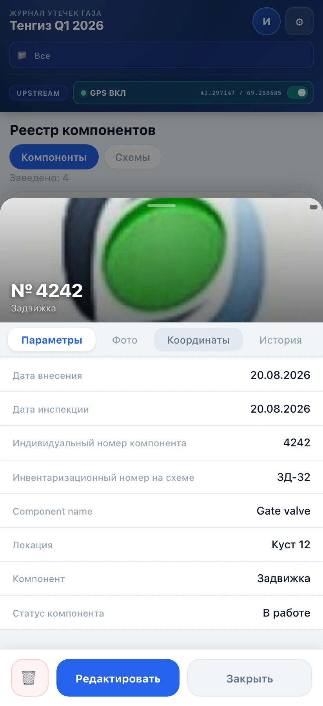

**«Редактировать»** правит карточку прямо здесь, не открывая форму заведения
заново. Координаты правятся только тут. **История** показывает, кто и когда
заводил, правил и осматривал, и что именно изменилось: «Номер на схеме:
ЗД1 → ЗД99». Удаление спрятано за значком корзины и требует подтверждения.

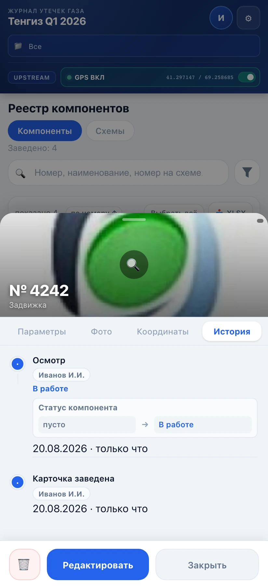

> Ни одна запись в реестре не делается без имени в профиле. Реестр, который
> никто не подписывает, — это список утверждений, за которыми не стоит человек.

### Схемы

Вкладка **«Схемы»** хранит технологические чертежи проекта: их загружают
заранее или добавляют по ходу работы. Сверху поиск по названию и месту, под ним
кнопка **«Добавить схему»**.

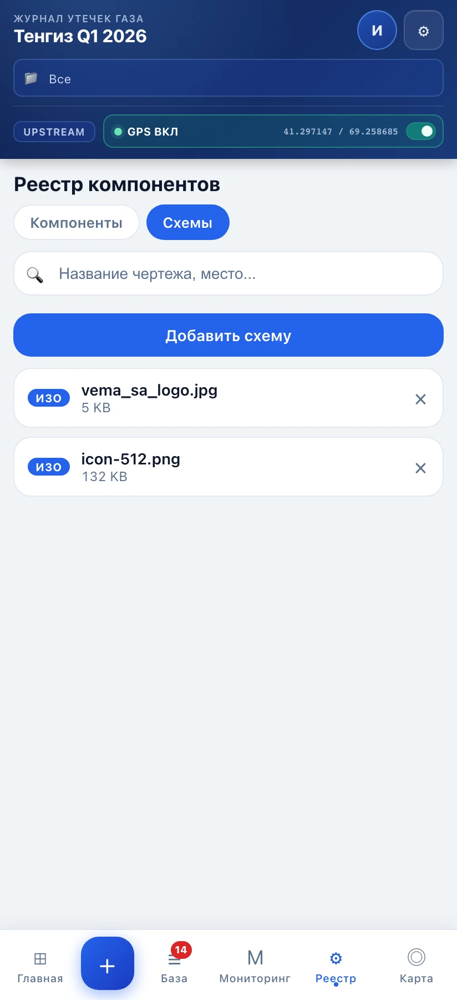

- **Изображения** открываются встроенным просмотрщиком: масштаб пальцами,
  двойное нажатие — вписать, кнопка «Закрыть».
- **PDF** отдаётся тому приложению, которым телефон читает PDF: там есть
  постраничная навигация и поиск по тексту.

Чертежи едут в архиве инвентаризации и в ZIP-бэкапе проекта, так что при
переносе на другой телефон их не нужно загружать заново.

### Компоненты на карте

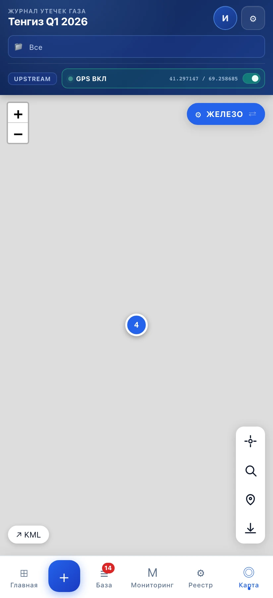

На карте есть переключатель баз — пилюля в правом верхнем углу: **«Утечки»** или
**«Железо»**. Карта показывает по одной базе за раз; на базе железа фильтры по
статусу, приоритету и обходу пропадают, потому что к оборудованию они не
относятся, а кнопка **KML** выгружает именно компоненты.

---

## 11. Карта

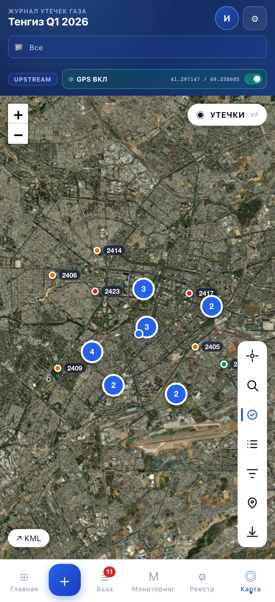

Маркеры окрашены по статусу, рядом — номер бирки. Близкие маркеры собираются в
кластеры с числом записей; нажатие раскрывает их. Нажатие на маркер показывает
бирку, компонент, описание и статус.

Панель кнопок справа: моё местоположение, поиск по номеру бирки, фильтр по
мониторингу, фильтр по статусу, фильтр по приоритету, утечки рядом и скачивание
тайлов текущей области в офлайн-кэш.

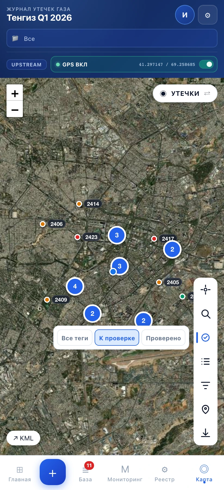

Кнопка **KML** внизу слева выгружает видимые записи в KML для Google Earth и ГИС.

Если у проекта есть реестр компонентов, в правом верхнем углу карты стоит
переключатель баз: **«Утечки»** или **«Железо»**. Карта показывает по одной базе
за раз, кнопки фильтров меняются вместе с ней, и KML выгружает ту базу, что на
экране.

**Офлайн-карта.** Тайлы, скачанные в кэш, отображаются без сети. Пока связь
есть, каждый просмотренный тайл кэшируется автоматически. Размер кэша и его
очистка — в настройках.

> На карте видны только утечки с координатами. Записи, сохранённые без GPS,
> ищите в Базе.

---

## 12. Настройки

Шестерёнка в шапке.

### Проекты

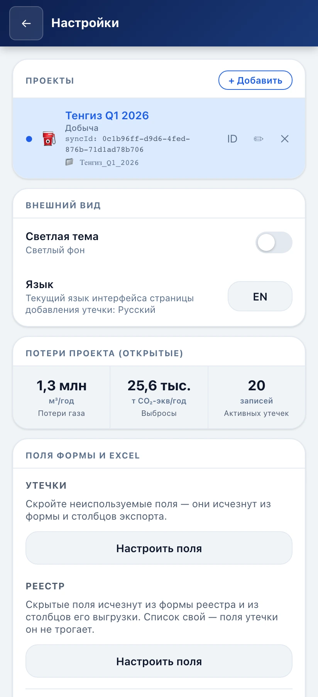

Список проектов: переключение, переименование, удаление, создание нового.
Активный проект отмечен. Переключение проекта сбрасывает незаконченную форму
добавления утечки и очищает кэш карты.

Ниже — блок **«Внешний вид»** (тема и язык) и сводка **«Потери проекта
(открытые)»**: годовые потери газа в м³, выбросы в тоннах CO₂-эквивалента и
число активных утечек.

### Поля формы и Excel

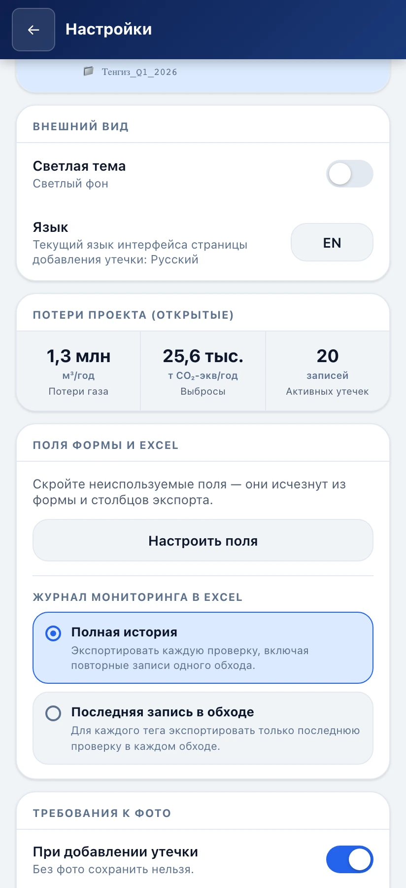

**«Настроить поля»** — скрытие неиспользуемых полей: они исчезают и из формы, и
из столбцов экспорта. Поля «№», «Дата обнаружения», «Статус» и «Дата устранения»
системные и скрыть их нельзя.

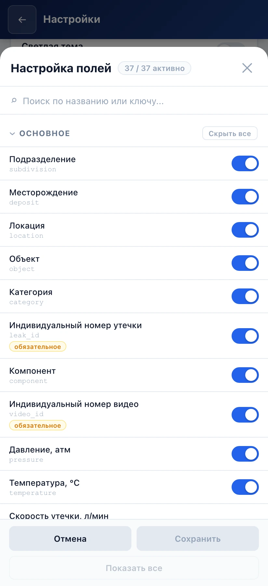

**Журнал мониторинга в Excel** — два режима:

- **Полная история** — каждая проверка, включая повторные записи одного обхода;
- **Последняя запись в обходе** — по одной последней проверке на тег в каждом обходе.

### Требования к фото

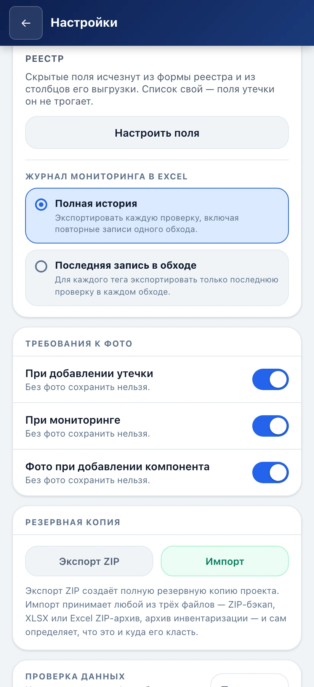

Отдельно для добавления утечки, для мониторинга и для карточки компонента: фото
обязательно или необязательно.

### Резервная копия

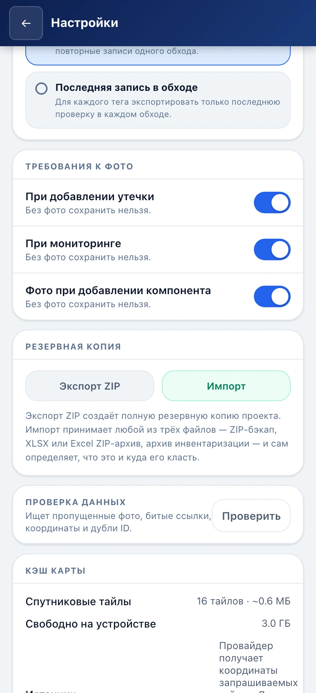

Экспорт ZIP и импорт файла любого из трёх форматов — см.
[раздел 13](#13-перенос-данных-zip-excel-qr).

### Проверка данных

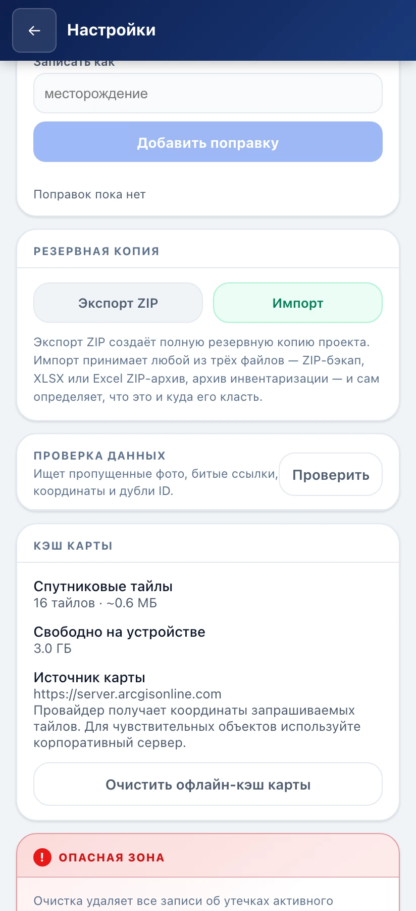

Кнопка «Проверить» ищет в проекте проблемы: записи без фото (до / ремонта /
после), проверки мониторинга без фото, битые ссылки на фотографии, записи без
координат и дубли номеров бирок. Проверка учитывает настройки обязательности
фото.

### Кэш карты

Ниже на том же экране — количество сохранённых тайлов и занятый объём, адрес
источника карты и кнопка **«Очистить офлайн-кэш карты»**.

> Провайдер тайлов получает координаты запрашиваемых участков. Для чувствительных
> объектов используйте корпоративный тайловый сервер.

### Опасная зона

**«Очистить базу данных»** удаляет все записи активного проекта. Действие
необратимо — сначала сделайте экспорт ZIP.

---

## 13. Перенос данных: ZIP, Excel, QR

### ZIP-бэкап

**Экспорт ZIP** создаёт полную копию проекта:

```text
project.json             метаданные проекта (название, тип, параметры, настройки)
backup.json              все записи утечек
photos/                  фото до, ремонта, после и мониторинга
components.json          реестр компонентов
component_photos/        снимки компонентов
technological_schemas/   технологические схемы
```

Повторная выгрузка **заменяет** прежний файл с тем же именем, а не кладёт рядом
«отчёт (1).zip»: в папке остаётся одна копия — та, что названа в сообщении на
экране. Если имя занято файлом, который приложению не принадлежит, оно скажет об
этом, а не перезапишет чужое молча.

Восстанавливается всё перечисленное: записи, фотографии, фильтры, параметры
расчёта, активный обход, реестр и чертежи. Если проект с таким именем уже есть,
приложение показывает сравнение и предлагает выбор: **«Перезаписать»**,
**«Объединить»** или **«Создать копию»**.

В сравнении видно не только, сколько записей об утечках добавится, обновится и
пропустится, но и отдельный блок **«Реестр компонентов»**: сколько карточек
добавится, сколько обновится и сколько при них снимков. Блок отдельный
намеренно — карточки железа не путают с записями об утечках, а решение по
архиву принимают одной кнопкой, и принимать его вслепую нельзя.

### Импорт: одна кнопка

Кнопка **«Импорт»** принимает любой из трёх файлов, и приложение само
определяет, что ему принесли:

| Что принесли                                 | Что произойдёт                                 |
| -------------------------------------------- | ---------------------------------------------- |
| ZIP-бэкап проекта                            | Восстановление проекта целиком                 |
| XLSX или Excel ZIP-архив (книга + `photos/`) | Импорт записей утечек                          |
| Архив инвентаризации                         | Вливание в реестр компонентов текущего проекта |

Архив инвентаризации не несёт ни названия проекта, ни его типа — только
карточки. Пока реестр вёл один тип, приложение угадывало тип само; теперь его
ведут все три, и угадывать стало не из чего. Поэтому тип выбирают на экране,
как и для любого другого проекта: без выбора импорт остановится и скажет
«Выберите тип проекта». А вот название подставится само — из имени файла, если
поле оставили пустым. В уведомлении будет видно, какой проект появился и
сколько карточек в нём.

Выбирать формат вручную не нужно — и не получится ошибиться кнопкой. Тип
определяется по содержимому файла, а не по его имени, так что переименованный или
отданный системой без расширения архив всё равно будет разобран правильно. Если
файл не опознан, приложение так и скажет, вместо непонятной ошибки разбора.

Перед импортом Excel показывается сводка: сколько строк найдено, сколько будет
импортировано, сколько фото и сколько строк пропущено.

**Ограничения.** Архив принимается размером до 1 ГБ и до 65 535 файлов внутри —
столько же, сколько приложение способно записать само, поэтому свою же выгрузку
оно всегда прочитает обратно. Это потолок безопасности, а не обещание: разбор
идёт в памяти телефона, и архив у самой границы слабому устройству не по силам.

На первом экране (когда проектов ещё нет) работает та же кнопка, и архивом
инвентаризации там можно **завести проект**: название берётся из имени файла.

### Два архива-отчёта

Кнопка **XLSX** есть и в Базе, и в Реестре, и выгружают они разное — это разные
работы для разных людей:

```text
!Database_<проект>.zip          из Базы: утечки, мониторинг, история + photos/
!Inventorization_<проект>.zip   из Реестра: компоненты, их история + Photos/ и Schemes/
```

В обеих книгах есть скрытый служебный лист — по нему архив возвращается обратно
без потерь. Не удаляйте его, если собираетесь импортировать файл назад; на
чтение он не мешает.

Править книгу в Excel можно: при импорте служебный лист остаётся основой, а
видимый лист ложится **правками поверх** — исправленная ячейка доходит до
приложения, пустая ничего не стирает, дописанная строка становится новой
записью. История осмотров и снимки, которых в плоской таблице нет, при этом
сохраняются, а отметка времени поднимается только у тех записей, которых правка
действительно коснулась. Так же читается и лист инвентаризации.

В листе инвентаризации колонка **«Фото»** — это ссылка: распаковали архив,
открыли книгу, нажали на ячейку — открылся снимок из папки `Photos/`.

### QR-синхронизация (Android)

Передача базы между телефонами в одной Wi-Fi-сети или через точку доступа,
без интернета:

1. На телефоне с актуальной базой — **«Показать QR»**. QR действует 3 минуты.
2. На втором телефоне — одна кнопка **«Сканировать QR»**. Что делать дальше,
   приложение решает само по коду: если это база открытого проекта — она
   синхронизируется, если чужая — приходит как новый проект. Базу опознаёт
   внутренний идентификатор, поэтому переименование проекта ничего не путает.
3. Первый телефон подтверждает передачу.

QR-сеанс закрывается после первой успешной передачи, если заранее не разрешён
импорт на несколько устройств. Проекты сверяются по `syncId`, чтобы случайно не
объединить разные базы.

По QR едет проект целиком — вместе с реестром компонентов, их снимками и
технологическими схемами. Совпавшие номера компонентов не сводятся молча: обе
карточки остаются, и их показывают как конфликт, чтобы человек решил, какую
перенумеровать.

> Запускайте QR-синхронизацию только в доверенной сети.

---

## 14. Тема и язык

В настройках, блок «Внешний вид»: переключатель тёмной/светлой темы и кнопка
языка (RU / EN). Оба выбора сохраняются между запусками.

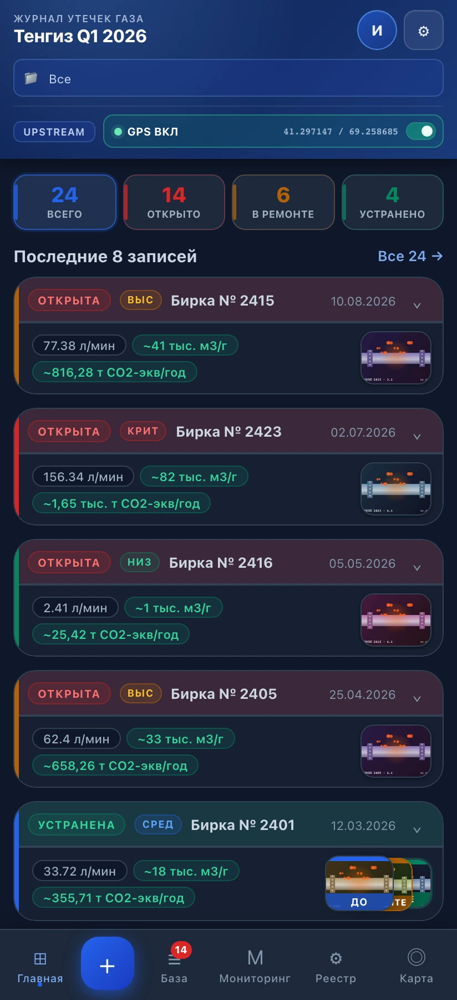
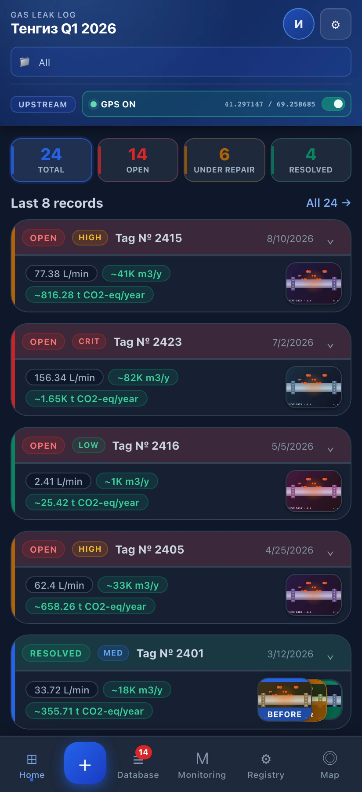

---

## 15. Частые вопросы

**Утечка не появилась на карте.**
Она сохранена без координат. Проверьте, что GPS включён (тумблер в шапке), и
добавьте координаты через «Редактировать» в подробной карточке.

**Не сохраняется утечка.**
Три обычные причины: не заполнено имя в профиле, не указан серийный номер
оборудования в параметрах расчёта, или в проекте включено обязательное фото, а
фото нет. Точную причину показывает уведомление.

**Утечка с таким номером уже существует.**
Номер бирки в проекте уникален. Найдите существующую запись поиском по номеру в
Базе.

**Куда делись записи после переключения проекта.**
Каждый проект — свой журнал. Вернитесь к нужному проекту в настройках.

**Список пуст, хотя записи есть.**
Скорее всего действует область (кнопка пути в шапке) или фильтр статуса. Нажмите
«Показать все» в выборе объекта и снимите фильтры.

**Карта серая без интернета.**
Отображаются только тайлы из офлайн-кэша. Скачайте нужную область заранее
кнопкой загрузки на карте, пока есть связь.

**Как перенести данные на другой телефон.**
Экспорт ZIP → перенести файл → импорт ZIP на втором устройстве. На Android
быстрее через QR-синхронизацию.

---

## 16. Справочник

### Статусы

| Статус        | Значение                        |
| ------------- | ------------------------------- |
| **Открыта**   | утечка зарегистрирована         |
| **В ремонте** | ремонт начат, есть фото ремонта |
| **Устранена** | устранена, есть фото после      |

### Приоритеты

| Приоритет | Метка на карточке |
| --------- | ----------------- |
| Критичный | КРИТ              |
| Высокий   | ВЫС               |
| Средний   | СРЕД              |
| Низкий    | НИЗ               |

### Состояния компонента

Список открытый: если нужного состояния нет, его можно вписать руками, и оно
появится в фильтре наравне со словарными.

| Состояние                   | Значение                              |
| --------------------------- | ------------------------------------- |
| **В работе**                | железо на месте и работает            |
| **В резерве**               | стоит, но не задействовано            |
| **Законсервирован**         | выведено из работы намеренно          |
| **Требует замены**          | найдено в состоянии, требующем замены |
| **Выведен из эксплуатации** | больше не работает                    |
| **Демонтирован**            | снято с места                         |

### Среда применения

Заказчик различает среду по составу газа, а не по названию продукта, поэтому в
подсказках поля три значения:

| Среда                                            | Значение                    |
| ------------------------------------------------ | --------------------------- |
| **Сырой газ**                                    | как пришёл со скважины      |
| **Очищенный газ (товарный газ)**                 | после подготовки            |
| **Газ с большим содержанием кислых компонентов** | сероводород, углекислый газ |

Поле свободное: автокомплит только подсказывает. В карточках, заведённых
раньше, остаётся то значение, которое там записали.

### Где что хранится

| Платформа | Записи утечек                                              | Реестр компонентов  | Фотографии        |
| --------- | ---------------------------------------------------------- | ------------------- | ----------------- |
| Android   | SQLite                                                     | Тот же SQLite       | Файлы в хранилище |
| Веб       | IndexedDB                                                  | Отдельная IndexedDB | IndexedDB         |
| Обе       | Настройки, фильтры и активный проект — локальное хранилище |                     |                   |

Данные не покидают устройство: серверной части, облака и телеметрии нет.

---

## Как обновить скриншоты

Снимки в `docs/manual/img/` собираются скриптом, который проходит по приложению
теми же шагами, что и пользователь:

```bash
npm run build && npx vite preview --host 127.0.0.1 --port 4173
```

```bash
node scripts/capture-manual-screenshots.mjs
```

---

## Руководство по Android

Отдельное руководство со снимками с реального устройства лежит исходником:
[`manual/android/manual.html`](manual/android/manual.html), картинки — рядом, в
`manual/android/img/`. Открывается в браузере как есть.

Собранный PDF в репозитории не хранится. Он сжат, поэтому не жмётся паком и не
складывается в дельту с предыдущей версией: четыре пересборки оставили в
истории 40 МБ, и каждая следующая добавляла бы ещё около десяти. Печатается он
из того же исходника за одну команду:

```bash
node scripts/build-android-manual-pdf.mjs
```

Результат — `docs/Leak-Tracker-Android-Manual.pdf`, в `.gitignore`. Если
руководство изменилось и снимки нужно переснять, перед печатью запускается сбор
кадров с подключённого устройства или эмулятора:

```bash
node scripts/capture-android-manual-screenshots.mjs
```
